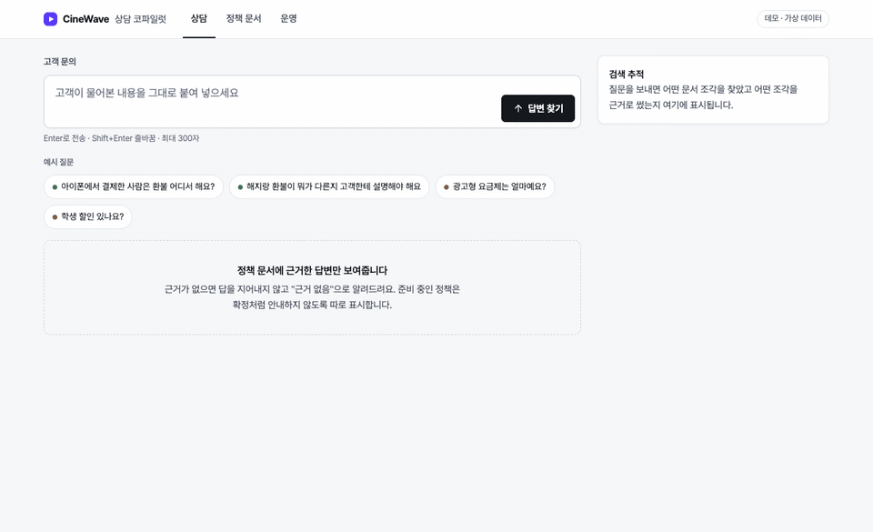
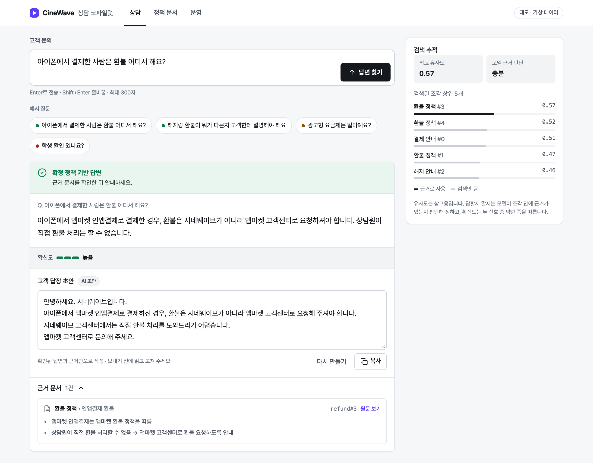
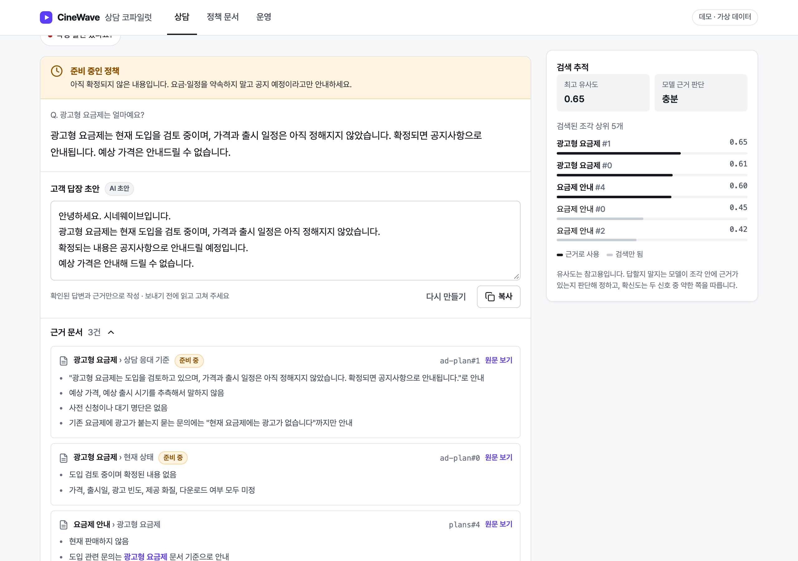
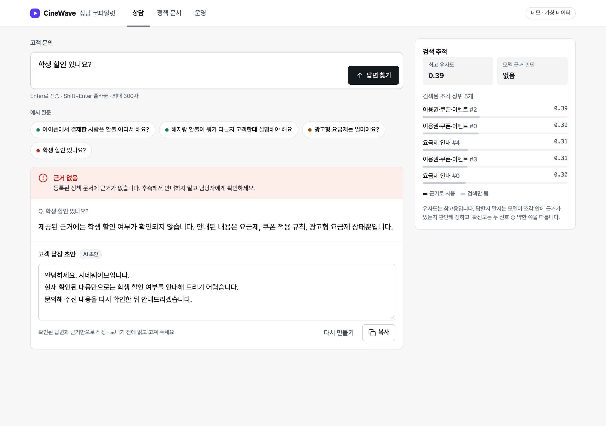
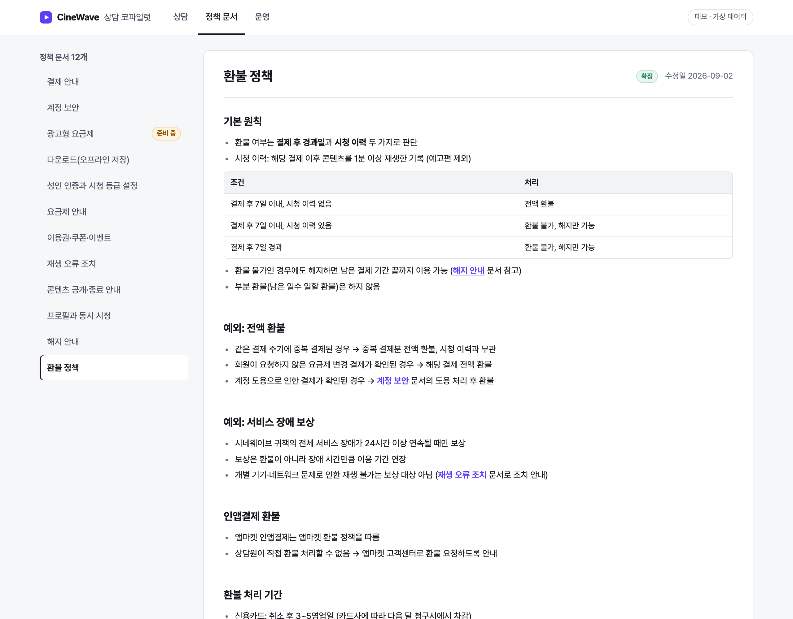
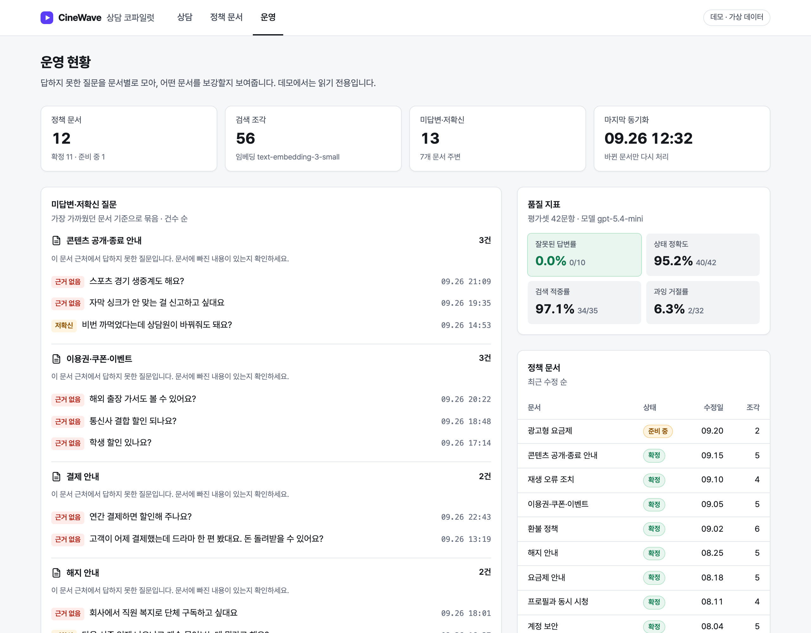
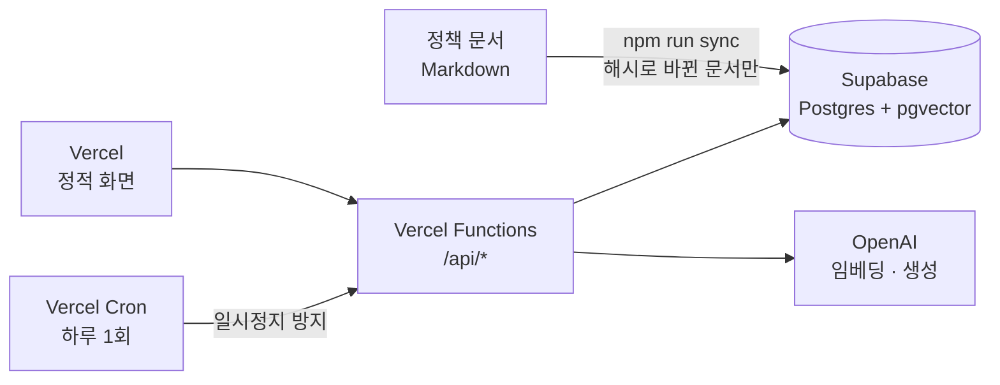

<div align="center">

# CineWave 상담 코파일럿

**근거가 있으면 근거와 함께 답하고, 없으면 모른다고 말하는 고객센터 AI**

가상 OTT 서비스 시네웨이브(CineWave) 고객센터 상담원을 위한 정책 답변 코파일럿

[](https://helpdesk-copilot.vercel.app)




</div>

| 잘못된 답변률 | 상태 정확도 | 과잉 거절률 | 검색 적중률 |
|:---:|:---:|:---:|:---:|
| **0%** (0/10) | **95.2%** (40/42) | **6.3%** (2/32) | **97.1%** (34/35) |
| 답하면 안 되는 질문에 답한 비율 | 확정·준비 중·근거 없음 판정 | 답할 수 있는데 거절한 비율 | 정답 문서가 상위 5개 안에 |

> 평가셋 42문항 기준. 회사·요금·정책·오류 코드는 모두 데모용 가상 데이터이며 실존 서비스와 무관

---

## 30초 둘러보기

- 링크를 누르면 질문과 고객 답장 초안까지 바로 실행
  - [확정 답변](https://helpdesk-copilot.vercel.app/?q=%EC%95%84%EC%9D%B4%ED%8F%B0%EC%97%90%EC%84%9C%20%EA%B2%B0%EC%A0%9C%ED%95%9C%20%EC%82%AC%EB%9E%8C%EC%9D%80%20%ED%99%98%EB%B6%88%20%EC%96%B4%EB%94%94%EC%84%9C%20%ED%95%B4%EC%9A%94%3F&reply=1): "아이폰에서 결제한 사람은 환불 어디서 해요?"
  - [준비 중 정책](https://helpdesk-copilot.vercel.app/?q=%EA%B4%91%EA%B3%A0%ED%98%95%20%EC%9A%94%EA%B8%88%EC%A0%9C%EB%8A%94%20%EC%96%BC%EB%A7%88%EC%98%88%EC%9A%94%3F&reply=1): "광고형 요금제는 얼마예요?"
  - [근거 없음](https://helpdesk-copilot.vercel.app/?q=%ED%95%99%EC%83%9D%20%ED%95%A0%EC%9D%B8%20%EC%9E%88%EB%82%98%EC%9A%94%3F&reply=1): "학생 할인 있나요?"
- 탭: 상담 · 정책 문서 · 운영
- 호출 한도를 넘거나 서버에 닿지 못하면 평가 때 저장한 실제 응답으로 동작하는 목업 모드로 전환

---

## 1. 장면

- 오후 2시, 입사 3주 차 상담원에게 채팅 문의
  - "어제 결제했는데 드라마 한 편 봤어요. 환불돼요?"
- 사내 위키에 환불 문서가 두 개. 어느 쪽이 최신인지 모름
- 옆자리 선배에게 물어봄: "7일 안이면 돼요"
  - 빠진 조건: **시청 이력이 없어야** 전액 환불
- 고객은 환불된다는 안내를 믿고 기다림 → 재문의 → "상담원마다 말이 다르다"는 불만

## 2. 문제

- **인력이 회전문처럼 바뀜**
  - 오래 일한 사람이 나가면 그 사람이 알던 예외와 최신 기준도 같이 사라짐
- **어떤 정보가 최신인지는 사람의 기억에만 있음**
  - 문서는 있지만 여러 벌이고, 준비 중인 정책과 확정된 정책이 섞여 있음
  - 신입은 같은 질문을 반복해서 묻고, 답하는 사람마다 조금씩 다름
- **답이 흔들리면 고객 만족도가 떨어짐**
  - 잘못된 안내 → 재문의 → 불만 → 상담 시간 증가의 악순환
- **어떤 문서가 비어 있는지 아무도 모름**
  - 답하지 못한 질문이 기록되지 않아서, 문서를 어디부터 보강할지 판단할 근거가 없음

## 3. 왜 AI인가, 왜 AI만으로는 안 되는가

| AI가 잘하는 것 | AI만 쓰면 생기는 일 |
|---|---|
| 구어체 질문("돈 돌려받을 수 있어요?")을 정책 문서와 연결 | 문서에 없는 내용을 그럴듯하게 지어냄 |
| 여러 문서에 흩어진 조건을 모아 한 번에 정리 | 준비 중인 정책을 확정된 것처럼 안내 |
| 고객에게 보낼 문장을 정중하게 다듬음 | 틀려도 자신 있게 말해서 상담원이 검증할 수 없음 |

- 그래서 목표를 "정답률"이 아니라 **잘못된 답변 0**으로 둠
- 답을 못 하는 건 괜찮음. 틀린 답을 확신 있게 하는 게 가장 큰 사고

## 4. 설계

### 답변은 세 가지 상태 중 하나

<table>
<tr>
<td width="33%"></td>
<td width="33%"></td>
<td width="33%"></td>
</tr>
<tr>
<td><b>확정 답변</b><br>근거 문서·확신도와 함께 안내</td>
<td><b>준비 중 정책</b><br>"요금·일정을 약속하지 말 것"</td>
<td><b>근거 없음</b><br>추측하지 않고 담당자 확인 안내</td>
</tr>
</table>

### 파이프라인


### 핵심 결정

- **거절은 검색 점수가 아니라 모델의 근거 판단으로**
  - 답해야 하는 구어체 질문과 거절해야 하는 질문의 유사도가 겹침 (0.3 미만 ~ 0.69 vs 최대 0.48)
  - 검색 하한은 명백히 무관한 조각만 거르게 낮추고, 답할지는 "조각 안에 근거가 있는가"로 판단
- **확신도는 두 신호 중 약한 쪽**
  - 검색 점수와 모델의 근거 판단 중 낮은 쪽. 낮으면 "인용 원문을 직접 확인" 경고
- **검증할 수 있는 규칙은 프롬프트에만 맡기지 않음**
  - 검색 결과 없음 → 모델 호출 안 함
  - 모델이 답했다고 해도 인용 조각이 없으면 → 근거 없음
  - 준비 중 문서를 근거로 확정 답을 내면 → 준비 중 정책
- **상담원 답변과 고객 답장은 두 단계로**
  - 1단계는 정확성·근거 확인, 2단계는 말투. 상담원이 근거를 본 뒤에만 답장 생성
  - 답장 입력은 확인된 답변과 인용 근거뿐. 답장에 근거 밖 숫자가 있으면 코드가 경고
  - 첫 줄 "안녕하세요. 시네웨이브입니다."는 모델이 어겨도 코드가 맞춤
- **모르는 질문이 쌓이는 곳을 만듦**
  - 근거 없음·확신도 낮음 질문을 가장 가까운 문서별로 묶어 운영 화면에 표시 → 어느 문서를 보강할지 보임

### 화면

<table>
<tr>
<td width="50%"></td>
<td width="50%"></td>
</tr>
<tr>
<td><b>정책 문서</b><br>코파일럿이 검색하는 원문과 같은 동기화 결과. 근거 카드의 "원문 보기"로 해당 섹션까지 이동</td>
<td><b>운영</b><br>미답변 질문을 문서별로 묶어 보강 후보 표시, 품질 지표, 문서 현황<br><sub>스크린샷은 평가셋 질문으로 채운 예시</sub></td>
</tr>
</table>

### 인프라



- 공개 데모 비용 방어
  - IP별 분당 20회, IP별 하루 모델 호출 30회, 전체 하루 300회
  - 같은 질문 24시간 캐시, 질문 300자 제한
  - 한도를 넘으면 오류 대신 목업 모드
- 보안
  - 모든 테이블 RLS를 켜고 정책을 두지 않음, DB 함수는 서버 역할만 실행 가능
  - 답장은 `answerId`로만 요청받아 서버에 저장된 답변만 모델에 들어감
- 상세: [architecture.md](architecture.md) (다이어그램 5개, 설계 결정 12개, 평가 기록)

## 5. 결과

### 평가

- 평가셋 42문항: 직접 질문 13 · 구어체 12 · 여러 문서 조합 7 · 준비 중 정책 3 · 문서에 없는 질문 7
- 함정 문항 포함: 그럴듯하게 답하고 싶어지는 "해외 출장 가서도 볼 수 있어요?", 표 한 줄에만 있는 "연간 결제 상품 없음"

| 회차 | 변경 | 잘못된 답변률 | 상태 정확도 | 과잉 거절률 |
|---|---|:---:|:---:|:---:|
| 1차 | 유사도 하한 0.3 | 0% | 85.7% | 18.8% |
| 2차 | 하한 0.15, 거절은 모델 근거 판단으로 | **0%** | **95.2%** | **6.3%** |
| 실험 | 질문 재작성 추가 | - | 검색 적중 34 → 33 | 채택 안 함 |
| 3차 | 로컬 → Supabase pgvector 이전 | 0% | 95.2% | 6.3% |

- 남은 실패 2건도 원인과 함께 기록
  - "돈 돌려받을 수 있어요?": 구어 표현과 문서 용어("환불")의 어휘 차이
  - "연간 결제하면 할인해 주나요?": 답이 요금표 조각 안에 묻혀 검색 상위에 못 듦
- 저장소를 옮긴 뒤 검색 순서가 1문항 달라진 원인도 좁혀 봄
  - 같은 벡터로 비교하면 pgvector와 로컬 계산이 42/42 동일
  - 차이는 같은 텍스트를 다시 임베딩할 때 생기는 미세한 벡터 차이 → 해시 기반 증분 동기화가 결과 안정성에도 기여

### 테스트

- 단위 테스트 47개 (vitest): 코드 가드, 확신도, 증분 동기화, 답장 숫자 검사, API 제한·캐시·인증
- 단위 테스트는 가짜 임베더로 API 호출 없이, 평가는 실제 모델과 실제 저장소로

## 6. 배운 것

- **모르는 것을 모른다고 하는 게 기능**: 지표 우선순위(잘못된 답변 0 → 과잉 거절)를 먼저 정해야 설계가 정해짐
- **분포가 겹치면 임계값 조정은 실패를 옮길 뿐**: 두 분포를 먼저 그려 보고 판단 주체를 바꿈
- **그럴듯한 개선도 평가셋 앞에서는 손해일 수 있음**: 질문 재작성은 한 문항을 고치고 다른 문항을 망가뜨림
- **제한값은 배포해서 직접 써 보고 정함**: 분당 6회로 시작했다가 실제 사용 패턴을 보고 역할별 3단 제한으로
- 전체 12개: [docs/lessons.md](docs/lessons.md)

---

## 로컬에서 실행

```bash
npm install
cp .env.example .env        # OPENAI_API_KEY 입력 (Supabase 값은 비워 두면 로컬 파일로 동작)
npm run sync                # 정책 문서 → 조각 → 임베딩 인덱스
npm run dev                 # http://localhost:3000
```

- API 키 없이 보기: `src/web/public/index.html`을 브라우저로 열면 목업 모드
- 그 밖의 명령

| 명령 | 내용 |
|---|---|
| `npm run ask -- "질문"` | CLI로 질문 |
| `npm run eval` | 평가셋 42문항 실행, 지표와 틀린 문항 출력 |
| `npm test` | 단위 테스트 |
| `npm run mock` | 평가 결과로 목업 데이터 생성 |
| `npm run build` | Vercel Build Output 생성 |

- 배포: Supabase에 `supabase/migrations/*.sql` 실행 → `.env`에 Supabase 값 → `npm run sync` → Vercel 연결 (빌드 명령 `npm run build`, 환경 변수 `OPENAI_API_KEY` · `SUPABASE_URL` · `SUPABASE_SECRET_KEY` · `CRON_SECRET`)

## 저장소 구조

```
src/core/            검색 · 판단 · 확신도 · 답장 · 동기화 (저장소에 의존하지 않는 로직)
src/server/          API 핸들러, 저장소 구현(Supabase·메모리), Vercel 진입점
src/web/public/      정적 화면 (프레임워크 없음)
data/synthetic/      가상 정책 문서 12개, 평가셋 42문항
supabase/migrations/ DB 스키마
scripts/             sync · ask · eval · mock · dev · build
test/                단위 테스트
docs/                설계 문서, 배운 것, README 이미지
```

## 문서

- [architecture.md](architecture.md): 다이어그램, 설계 결정과 이유, 평가 기록
- [docs/design.md](docs/design.md): 설계 문서 (목표, 가상 회사 설정, 화면 구성, 단계 계획)
- [docs/lessons.md](docs/lessons.md): 설계·평가·배포하며 배운 것

---

<div align="center">
<sub>만든 사람 <b>강민정</b> · <a href="https://github.com/EXPOIR0405">GitHub</a></sub>
</div>
