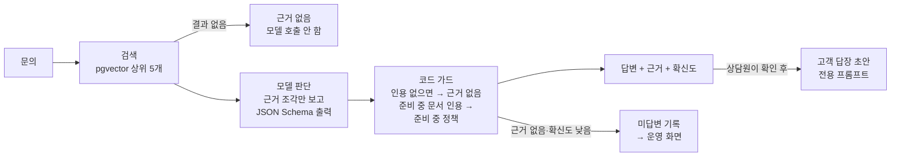
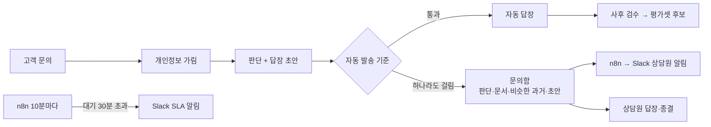
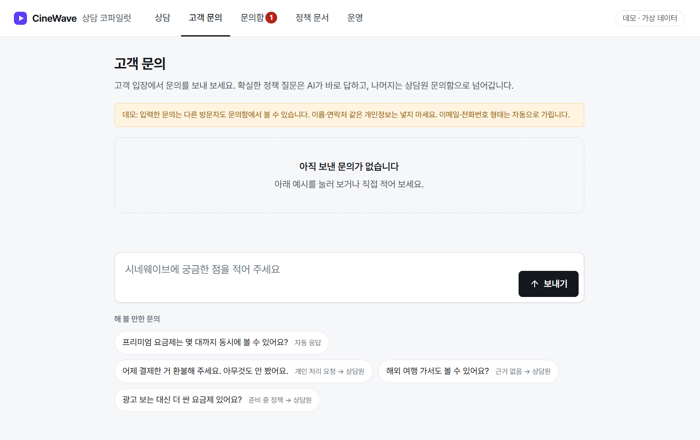
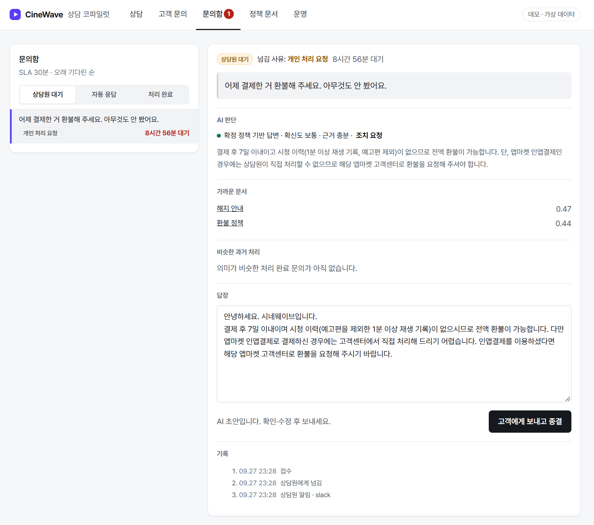
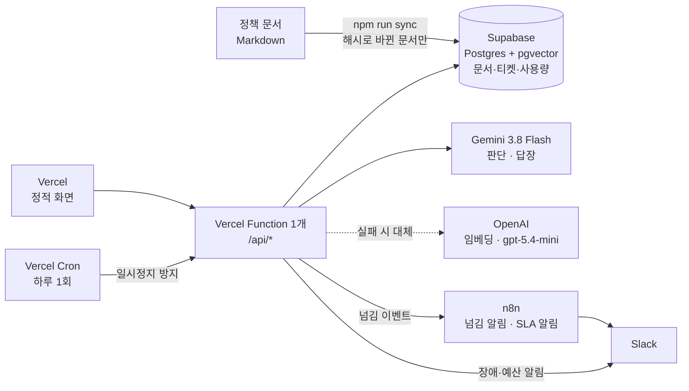

<div align="center">

# CineWave 상담 코파일럿 · 자동 응대

**근거가 있으면 답하고, 확실한 것만 스스로 처리하고, 나머지는 맥락과 함께 사람에게 넘기는 고객센터 AI**

가상 OTT 서비스 시네웨이브(CineWave) 고객센터를 위한 정책 답변 코파일럿과 자동 응대 에이전트

[](https://helpdesk-copilot.vercel.app)


</div>

**상담원 코파일럿** — 평가셋 42문항 × 3회

| 잘못된 답변률 | 상태 정확도 | 과잉 거절률 | 검색 적중률 |
|:---:|:---:|:---:|:---:|
| **0%** (0/30) | **95.2%** (120/126) | **6.3%** (6/96) | **97.1%** (102/105) |
| 답하면 안 되는 질문에 답한 비율 | 확정·준비 중·근거 없음 판정 | 답할 수 있는데 거절한 비율 | 정답 문서가 상위 5개 안에 |

**자동 응대** — 고객 말투 22문항 × 3회

| 잘못된 자동 발송 | 조치 요청 분류 | 넘김 사유 일치 | 자동 처리율 |
|:---:|:---:|:---:|:---:|
| **0/33** | **18/18** | **33/33** | **72.7%** (24/33) |
| 사람에게 넘겨야 하는데 자동으로 보낸 건 | "환불해 주세요"를 조치 요청으로 | 넘긴 이유가 기대와 같음 | 자동으로 답해도 되는 문의 중 |

> 생성 모델 `gemini-3.8-flash` (모델 10개 비교 후 선택), 대체 `gpt-5.4-mini`. 회사·요금·정책·오류 코드는 모두 데모용 가상 데이터이며 실존 서비스와 무관

---

## 30초 둘러보기

- **상담원 코파일럿**: 링크를 누르면 질문과 고객 답장 초안까지 바로 실행
  - [확정 답변](https://helpdesk-copilot.vercel.app/?q=%EC%95%84%EC%9D%B4%ED%8F%B0%EC%97%90%EC%84%9C%20%EA%B2%B0%EC%A0%9C%ED%95%9C%20%EC%82%AC%EB%9E%8C%EC%9D%80%20%ED%99%98%EB%B6%88%20%EC%96%B4%EB%94%94%EC%84%9C%20%ED%95%B4%EC%9A%94%3F&reply=1): "아이폰에서 결제한 사람은 환불 어디서 해요?"
  - [준비 중 정책](https://helpdesk-copilot.vercel.app/?q=%EA%B4%91%EA%B3%A0%ED%98%95%20%EC%9A%94%EA%B8%88%EC%A0%9C%EB%8A%94%20%EC%96%BC%EB%A7%88%EC%98%88%EC%9A%94%3F&reply=1): "광고형 요금제는 얼마예요?"
  - [근거 없음](https://helpdesk-copilot.vercel.app/?q=%ED%95%99%EC%83%9D%20%ED%95%A0%EC%9D%B8%20%EC%9E%88%EB%82%98%EC%9A%94%3F&reply=1): "학생 할인 있나요?"
- **자동 응대**: [고객 문의](https://helpdesk-copilot.vercel.app/#/support)에서 예시를 눌러 보기
  - "프리미엄 몇 대까지 돼요?" → AI가 바로 답함
  - "어제 결제한 거 환불해 주세요" → 접수 안내 후 [문의함](https://helpdesk-copilot.vercel.app/#/inbox)으로. 판단 근거·가까운 문서·비슷한 과거 처리·답장 초안이 모여 있음
  - 문의함에서 초안을 고쳐 보내면 고객 문의 화면에 상담원 답장으로 나타남
- [운영](https://helpdesk-copilot.vercel.app/#/ops): 자동 처리율·넘김 사유, 오늘 비용·대체 모델 전환·실패, 품질 지표, 보강할 문서
- 호출 한도를 넘거나 서버에 닿지 못하면 평가 때 저장한 실제 응답으로 동작하는 목업 모드로 전환

---

## 1. 장면

- 오후 2시, 입사 3주 차 상담원에게 채팅 문의
  - "어제 결제했는데 드라마 한 편 봤어요. 환불돼요?"
- 사내 위키에 환불 문서가 두 개. 어느 쪽이 최신인지 모름
- 옆자리 선배에게 물어봄: "7일 안이면 돼요"
  - 빠진 조건: **시청 이력이 없어야** 전액 환불
- 고객은 환불된다는 안내를 믿고 기다림 → 재문의 → "상담원마다 말이 다르다"는 불만
- 같은 시간 대기열에는 "프리미엄 몇 대까지 돼요?", "결제일 바꿀 수 있어요?" 같은 문서에 답이 그대로 있는 문의가 쌓여 있음

## 2. 문제

- **인력이 회전문처럼 바뀜**
  - 오래 일한 사람이 나가면 그 사람이 알던 예외와 최신 기준도 같이 사라짐
- **어떤 정보가 최신인지는 사람의 기억에만 있음**
  - 문서는 있지만 여러 벌이고, 준비 중인 정책과 확정된 정책이 섞여 있음
  - 신입은 같은 질문을 반복해서 묻고, 답하는 사람마다 조금씩 다름
- **반복 문의가 상담원 시간을 다 씀**
  - 문서에 답이 있는 질문도 사람이 하나씩 처리. 정작 사람이 봐야 하는 환불·도용 처리는 뒤로 밀림
- **어떤 문서가 비어 있는지 아무도 모름**
  - 답하지 못한 질문이 기록되지 않아서, 문서를 어디부터 보강할지 판단할 근거가 없음

## 3. 왜 AI인가, 왜 AI만으로는 안 되는가

| AI가 잘하는 것 | AI만 쓰면 생기는 일 |
|---|---|
| 구어체 질문("돈 돌려받을 수 있어요?")을 정책 문서와 연결 | 문서에 없는 내용을 그럴듯하게 지어냄 |
| 여러 문서에 흩어진 조건을 모아 한 번에 정리 | 준비 중인 정책을 확정된 것처럼 안내 |
| 고객에게 보낼 문장을 정중하게 다듬음 | 틀려도 자신 있게 말해서 상담원이 검증할 수 없음 |
| 반복되는 정책 질문에 바로 답함 | "환불해 주세요"처럼 사람이 처리해야 할 요청에도 답만 하고 끝냄 |

- 그래서 목표를 "정답률"이 아니라 **잘못된 답변 0**으로 둠
- 답을 못 하는 건 괜찮음. 틀린 답을 확신 있게 하는 게 가장 큰 사고
- 자동 응대는 한 단계 더 보수적으로: **사람 확인 없이 나가는 답은 확실한 것만**

## 4. 설계

### 4-1. 상담원 코파일럿: 답변은 세 가지 상태 중 하나

<table>
<tr>
<td width="33%"></td>
<td width="33%"></td>
<td width="33%"></td>
</tr>
<tr>
<td><b>확정 답변</b><br>근거 문서·확신도와 함께 안내</td>
<td><b>준비 중 정책</b><br>"요금·일정을 약속하지 말 것"</td>
<td><b>근거 없음</b><br>추측하지 않고 담당자 확인 안내</td>
</tr>
</table>



- **거절은 검색 점수가 아니라 모델의 근거 판단으로**
  - 답해야 하는 구어체 질문과 거절해야 하는 질문의 유사도가 겹침 (0.3 미만 ~ 0.69 vs 최대 0.48)
  - 검색 하한은 명백히 무관한 조각만 거르게 낮추고, 답할지는 "조각 안에 근거가 있는가"로 판단
- **확신도는 두 신호 중 약한 쪽**: 검색 점수와 모델의 근거 판단 중 낮은 쪽. 낮으면 "인용 원문을 직접 확인" 경고
- **검증할 수 있는 규칙은 프롬프트에만 맡기지 않음**
  - 검색 결과 없음 → 모델 호출 안 함
  - 모델이 답했다고 해도 인용 조각이 없으면 → 근거 없음
  - 준비 중 문서를 근거로 확정 답을 내면 → 준비 중 정책
- **상담원 답변과 고객 답장은 두 단계로**
  - 1단계는 정확성·근거 확인, 2단계는 말투. 답장 입력은 확인된 답변과 인용 근거뿐
  - 답장에 근거 밖 숫자가 있으면 코드가 경고, 첫 줄 인사말은 모델이 어겨도 코드가 맞춤
- **모르는 질문이 쌓이는 곳을 만듦**: 근거 없음·확신도 낮음 질문을 가장 가까운 문서별로 묶어 운영 화면에 → 어느 문서를 보강할지 보임

### 4-2. 자동 응대: 확실한 것만 스스로, 나머지는 맥락과 함께 사람에게



- **자동 발송 기준**: 모두 통과해야 사람 확인 없이 발송. 기준은 코드 한 곳(`src/core/triage.ts`)

| 순서 | 걸리면 넘김 | 예 |
|---|---|---|
| 1 | 개인 처리 요청 | "환불해 주세요" — 정책상 환불 대상이어도 실제 처리는 사람이 |
| 2 | 근거 없음 · 준비 중 정책 | "해외에서도 돼요?", "광고형 요금제 언제 나와요?" |
| 3 | 저확신 | 근거는 있지만 검색 신호가 약함 |
| 4 | 근거 밖 숫자 | 답장에 확인되지 않은 수치가 들어감 |

- "환불은 어디서 해요?"(질문)와 "환불해 주세요"(조치 요청)를 가르려고 판단 출력에 `requestType` 추가
- **상담원이 다른 화면을 찾지 않게 맥락을 모아 넘김**
  - AI 판단·확신도, 가까운 문서와 점수, **질문 의미가 비슷한 처리 완료 티켓**(질문 벡터 유사도 0.5 이상), 고쳐 보낼 답장 초안, 처리 기록
- **판단은 코드, 연결은 n8n**
  - 자동 발송·넘김·맥락 수집은 API 코드 → 단위 테스트와 평가셋으로 검증
  - n8n은 흐름 연결: 넘김 알림, 10분마다 SLA 30분 초과 알림
  - n8n이 꺼져 있으면 API가 Slack으로 직접 보내고 실패를 기록 → 알림이 사라지지 않음
- 공개 데모라 이메일·전화·카드·주민번호 형태는 모델 호출과 저장 전에 가림
- 상세: [docs/auto-response-design.md](docs/auto-response-design.md), [n8n/README.md](n8n/README.md)

<table>
<tr>
<td width="42%"></td>
<td width="58%"></td>
</tr>
<tr>
<td><b>고객 문의</b><br>고객 입장에서 문의를 보내 보는 창. 예시마다 어느 경로로 갈지 표시</td>
<td><b>문의함</b><br>넘김 사유·AI 판단(조치 요청)·가까운 문서·비슷한 과거 처리·답장 초안·처리 기록이 한 화면에. 초안을 고쳐 바로 보내고 종결</td>
</tr>
</table>

### 4-3. 모델 선택: 10개를 같은 평가셋으로

- 모델을 설정 한 줄로 바꾸고(`src/core/models.ts`), 같은 42문항을 모델마다 3회 실행해 비교
  - 검색(임베딩)은 고정 → 생성 모델 차이만 봄. 추론 설정은 제공사마다 "낮음"으로 맞춤
- 공통으로 틀리는 문항은 모델이 아니라 프롬프트 문제 → 규칙을 3차까지 고치며 대표 모델 6개로 전후 비교

| 최종 (프롬프트 3차, 각 3회) | 잘못된 답변 | 상태 정확도 | 질문 1,000건 비용 | p95 |
|---|:---:|:---:|:---:|:---:|
| **gemini-3.8-flash (기본)** | 0/30 | 120/126 | $1.09 | 2.6s |
| gemini-3.5-flash-lite | 0/30 | 120/126 | $0.49 | 1.8s |
| **gpt-5.4-mini (대체)** | 0/30 | 120/126 | $1.36 | 2.9s |
| gpt-6-luna | 0/30 | 117/126 | $0.10 | 3.2s |

- 지표가 같은 상위 3개 중 **프롬프트를 세 번 바꾸는 동안 한 번도 흔들리지 않은** gemini-3.8-flash를 기본으로
- 대체는 **다른 제공사**: 한 제공사의 장애·키 문제·모델 종료에 같이 멈추지 않게
- 전체 과정(실험 설계, 기준 평가, 평가 도구 결함, 프롬프트 1~3차, 고르지 않은 이유): [docs/model-selection.md](docs/model-selection.md)

### 4-4. 운영 관리: 만들고 끝이 아니라 계속 돌아가게

- **대체 모델 전환**: 실패 종류에 따라 다르게

| 실패 | 예 | 처리 |
|---|---|---|
| 일시 | 429 · 5xx · 타임아웃 | 대체 모델 + warn 알림 |
| 제공사 설정 | 401 · 403 · 404 (키 폐기 · 모델 종료) | 대체 모델 + error 알림 (사람이 조치) |
| 요청 오류 | 400 · 422 | 넘기지 않음 — 코드 버그를 대체 모델이 가리지 않게 |

- **시간 예산**: Vercel 함수 30초 안에 기본 10초 + 대체 10초 + 임베딩(4초·1회 재시도)
  - 같은 제공사에 다시 보내기보다 다른 제공사로 넘기는 것을 재시도로 씀 (장애 중엔 같은 곳도 대부분 실패)
- **비용·품질 기록**: 판단·답장 호출마다 모델·토큰·비용·지연·대체·실패를 DB에 → 운영 탭에 7일 집계
- **Slack 알림**: 대체 전환 · 500 · 헬스체크 실패 · 하루 예산 80% · 상담원 넘김 · SLA 초과
  - 같은 알림은 30분에 한 번. 중복 확인을 DB로 해서 서버리스 인스턴스가 여러 개여도 한 번
- `/api/health`로 저장소·검색 조각 확인

### 4-5. 인프라



- **공개 데모 비용 방어**: IP별 분당 20회, IP별 하루 모델 호출 30회, 전체 하루 300회, 같은 질문 24시간 캐시, 질문 300자. 한도를 넘으면 오류 대신 목업 모드
- **보안**: 모든 테이블 RLS를 켜고 정책을 두지 않음, DB 함수는 서버 역할만 실행. 답장은 `answerId`로만 요청받아 서버에 저장된 답변만 모델에. n8n 전용 경로는 공유 비밀값 헤더로
- 상세: [architecture.md](architecture.md) (다이어그램, 설계 결정 17개, 평가 기록)

### 화면

<table>
<tr>
<td width="50%"></td>
<td width="50%"></td>
</tr>
<tr>
<td><b>정책 문서</b><br>코파일럿이 검색하는 원문과 같은 동기화 결과. 근거 카드의 "원문 보기"로 해당 섹션까지 이동</td>
<td><b>운영</b><br>미답변 질문을 문서별로 묶어 보강 후보 표시, 품질 지표, 문서 현황<br><sub>스크린샷은 자동 응대·비용 패널 추가 전</sub></td>
</tr>
</table>

## 5. 결과

### 코파일럿 평가

- 평가셋 42문항: 직접 질문 13 · 구어체 12 · 여러 문서 조합 7 · 준비 중 정책 3 · 문서에 없는 질문 7
- 함정 문항 포함: 그럴듯하게 답하고 싶어지는 "해외 출장 가서도 볼 수 있어요?", 표 한 줄에만 있는 "연간 결제 상품 없음"

| 회차 | 변경 | 잘못된 답변률 | 상태 정확도 | 과잉 거절률 |
|---|---|:---:|:---:|:---:|
| 1차 | 유사도 하한 0.3 | 0% | 85.7% | 18.8% |
| 2차 | 하한 0.15, 거절은 모델 근거 판단으로 | **0%** | **95.2%** | **6.3%** |
| 실험 | 질문 재작성 추가 | - | 검색 적중 34 → 33 | 채택 안 함 |
| 3차 | 로컬 → Supabase pgvector 이전 | 0% | 95.2% | 6.3% |
| 4차 | 모델 10개 × 3회 비교, 프롬프트 규칙 3차, `gemini-3.8-flash` | **0%** (0/30) | **95.2%** (120/126) | **6.3%** (6/96) |
| 5차 | 자동 응대용 `requestType` 추가 후 회귀 확인 | 0% (0/30) | 95.2% (120/126) | 6.3% (6/96) |

- 4차부터 3회 합산: 같은 설정도 실행마다 판단이 달라짐 (`gpt-5.4-mini` 재평가에서 잘못된 답변 0 → 1 → 0)
- 남은 실패 2건은 모든 모델 공통인 검색 단계 문제
  - "돈 돌려받을 수 있어요?": 구어 표현과 문서 용어("환불")의 어휘 차이
  - "연간 결제하면 할인해 주나요?": 답이 요금표 조각 안에 묻혀 검색 상위에 못 듦

### 자동 응대 평가

- 고객 말투 22문항 × 3회: 자동으로 답해도 되는 정책 질문 11 · 근거 없음 4 · 준비 중 1 · 조치 요청 6
  - "해지는 어디서 해요?" / "해지해 주세요"처럼 **비슷한 말, 다른 의도** 쌍을 넣음
- 기본·대체 모델 모두 잘못된 자동 발송 0/33, 조치 요청 분류 18/18
- 자동으로 못 보낸 3문항은 모두 저확신: 근거는 충분하지만 고객 말투라 검색 유사도가 기준(0.5) 아래
  - 잘못된 자동 발송 0을 우선해 1차는 보수적으로. 기준 조정은 평가셋으로 검증할 실험으로 [백로그](docs/backlog.md)

### 테스트

- 단위 테스트 102개 (vitest): 코드 가드, 확신도, 증분 동기화, 답장 숫자 검사, API 제한·캐시·인증, 대체 모델 전환·실패 분류, 알림 중복 방지, 비용 집계, 헬스체크, 자동 발송 기준, 개인정보 가림, 티켓 수명 주기·SLA, n8n 인증, 단일 함수 라우팅
- 단위 테스트는 가짜 임베더로 API 호출 없이, 평가는 실제 모델과 실제 저장소로

## 6. 운영하며 깨진 것과 고친 것

| 증상 | 원인 | 고친 것 |
|---|---|---|
| Windows에서 받은 저장소로 테스트 1개 실패 | CRLF 줄바꿈이면 frontmatter를 못 읽어 **준비 중 정책이 확정으로** 바뀜 (가드가 조용히 꺼짐) | 파서가 줄바꿈 정규화 + `.gitattributes`로 LF 고정 |
| 같은 설정인데 평가 결과가 README와 다름 | 모델 판단이 실행마다 흔들림 | 3회 합산 · 최악 회차 · 흔들린 문항 기록 |
| 호출 126건이 전부 404인 모델이 비교표 1위 | 호출 실패를 "답하지 않음"으로 채점 → 잘못된 답변률 0% | 실패율 20% 초과 평가는 무효, 비교표에 ⚠ |
| 대체 모델을 붙였는데 전환 전에 함수가 끝날 상황 | SDK 기본 타임아웃·재시도로 호출 하나가 최대 90초 | 호출 시간 예산을 요청 전체(30초)에서 거꾸로 나눔 |
| 운영 탭 미답변 목록에 깨진 글자 | Windows curl이 CP949로 보낸 질문을 그대로 처리 | UTF-8이 아니면 모델 호출 전에 400 |
| 문의가 "처리 실패"로 넘어감 | OpenAI 임베딩이 몇 분 멈춤. 임베딩은 대체 경로가 없는데 생성 모델용 설정을 씀, 실패 단계도 안 보임 | 임베딩 전용 4초·1회 재시도, "임베딩 실패:" 단계 표시 |
| 근거 없는 문의에 비슷한 과거 처리가 안 붙음 | "가까운 문서가 같은 티켓"으로 찾았는데 근거 없는 문의는 가까운 문서부터 엉뚱함 | 질문 벡터 유사도로, 기준 0.5는 실측으로 |
| n8n 재시작 직후 넘김 알림 404 | 헬스체크 OK 뒤에도 webhook 등록은 몇 초 늦음 | API가 Slack으로 직접 보내고 실패 기록 (실제로 동작 확인) |
| 미리보기 배포 실패 | Vercel Hobby "배포당 함수 12개" 한도, 경로를 더해 13개 | `/api/*`를 함수 하나로 |

- 각 항목의 상황·원인·적용: [docs/lessons.md](docs/lessons.md)

## 7. 배운 것

- **모르는 것을 모른다고 하는 게 기능**: 지표 우선순위(잘못된 답변 0 → 과잉 거절)를 먼저 정해야 설계가 정해짐
- **분포가 겹치면 임계값 조정은 실패를 옮길 뿐**: 두 분포를 먼저 그려 보고 판단 주체를 바꿈
- **한 번 돌린 평가는 믿을 수 없음**: 모델 비교는 1~2건 차이가 아니라 여러 조건에서 반복되는 패턴으로
- **실패를 안전한 쪽으로 채점하면 장애가 성과로 보임**: 지표가 좋아 보이면 먼저 측정이 제대로 됐는지
- **프롬프트 규칙은 좁게, 멈출 지점은 먼저**: 규칙 하나가 모델마다 다르게 읽힘. 평가셋에만 맞추지 않게 3차에서 멈춤
- **사람 확인이 빠지면 평가셋도 새로**: 자동 응대는 "틀린 답"보다 "넘겨야 하는데 보낸 건"이 최우선 지표
- **단위 테스트가 다 통과해도 끝까지 돌려 봐야 보이는 것이 있음**: 단일 장애점, 설계 휴리스틱의 실패, "떠 있음"과 "준비됨"의 차이
- 전체 18개: [docs/lessons.md](docs/lessons.md)

---

## 로컬에서 실행

```bash
npm install
cp .env.example .env        # OPENAI_API_KEY · GEMINI_API_KEY 입력 (Supabase 값은 비워 두면 로컬 파일로 동작)
npm run sync                # 정책 문서 → 조각 → 임베딩 인덱스
npm run dev                 # http://localhost:3000
```

- API 키 없이 보기: `src/web/public/index.html`을 브라우저로 열면 목업 모드
- 그 밖의 명령

| 명령 | 내용 |
|---|---|
| `npm run ask -- "질문"` | CLI로 질문 |
| `npm run eval -- --model <id> --runs 3` | 평가셋 42문항을 모델별로 여러 회 실행, 지표·틀린 문항·흔들린 문항·비용·지연 |
| `npm run eval:triage -- --model <id> --runs 3` | 자동 응대 평가 22문항: 잘못된 자동 발송·자동 처리율·조치 요청 분류 |
| `npm run compare` | 모델별 평가 결과 비교표 (프롬프트 버전 포함) |
| `npm test` | 단위 테스트 |
| `npm run mock` | 평가 결과로 목업 데이터 생성 |
| `npm run build` | Vercel Build Output 생성 |

- 배포: Supabase에 `supabase/migrations/*.sql` 실행 → `.env`에 Supabase 값 → `npm run sync` → Vercel 연결 (빌드 명령 `npm run build`)
  - 환경 변수: `OPENAI_API_KEY` · `GEMINI_API_KEY` · `SUPABASE_URL` · `SUPABASE_SECRET_KEY` · `CRON_SECRET` · `SLACK_WEBHOOK_URL`
  - 선택: `GENERATION_MODEL` · `FALLBACK_MODEL` · `N8N_WEBHOOK_URL` · `HELPDESK_N8N_SECRET` · `PUBLIC_BASE_URL`
- n8n 워크플로우: [n8n/README.md](n8n/README.md)

## 저장소 구조

```
src/core/            검색 · 판단 · 확신도 · 답장 · 동기화 · 모델 · 대체 · 알림 · 자동 발송 기준 · 티켓 (저장소에 의존하지 않는 로직)
src/server/          API 핸들러, 저장소 구현(Supabase·메모리), 넘김 알림, Vercel 진입점
src/web/public/      정적 화면: 상담 · 고객 문의 · 문의함 · 정책 문서 · 운영 (프레임워크 없음)
data/synthetic/      가상 정책 문서 12개, 평가셋 42문항, 자동 응대 평가셋 22문항
data/eval-models/    모델별 평가 결과, data/eval-triage/ 자동 응대 평가 결과
supabase/migrations/ DB 스키마 (문서·조각 · 사용량 · 티켓)
scripts/             sync · ask · eval · eval-triage · compare · mock · dev · build
n8n/                 n8n 워크플로우 (넘김 알림 · SLA 알림)
test/                단위 테스트
docs/                설계 문서, 모델 선택, 자동 응대 설계, 배운 것, 백로그
```

## 문서

- [architecture.md](architecture.md): 다이어그램, 설계 결정과 이유, 평가 기록
- [docs/model-selection.md](docs/model-selection.md): 생성 모델 10개 비교 실험과 선택 이유
- [docs/auto-response-design.md](docs/auto-response-design.md): 자동 응대 설계와 1차 결과
- [n8n/README.md](n8n/README.md): n8n 워크플로우 설정과 실행하며 알게 된 것
- [docs/lessons.md](docs/lessons.md): 설계·평가·배포·운영하며 배운 것 18개
- [docs/backlog.md](docs/backlog.md): 다음 단계 계획
- [docs/design.md](docs/design.md): 1단계 설계 문서 (목표, 가상 회사 설정, 화면 구성)

---

<div align="center">
<sub>만든 사람 <b>강민정</b> · <a href="https://github.com/EXPOIR0405">GitHub</a></sub>
</div>
