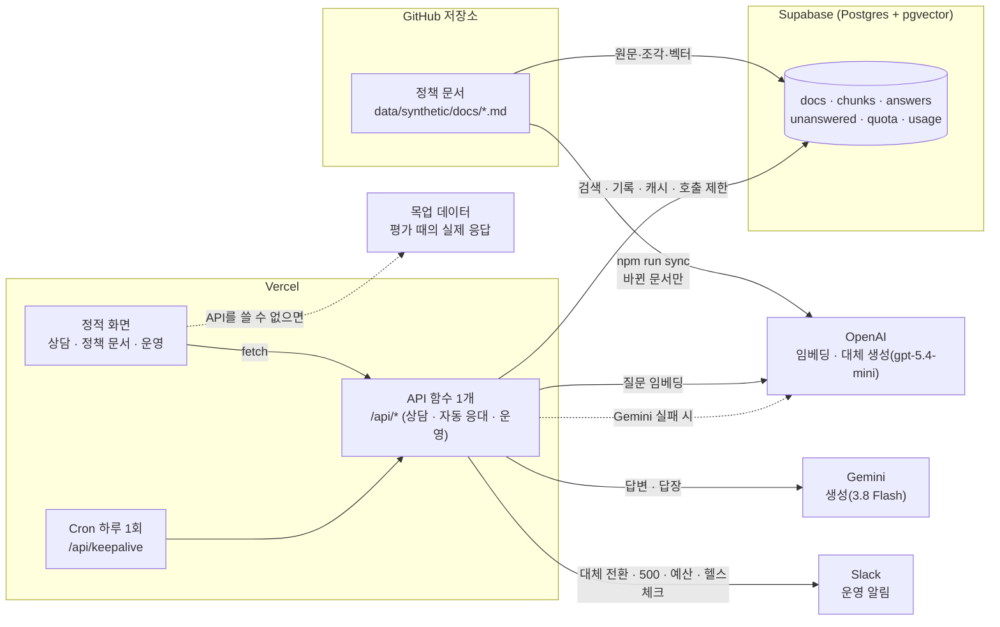
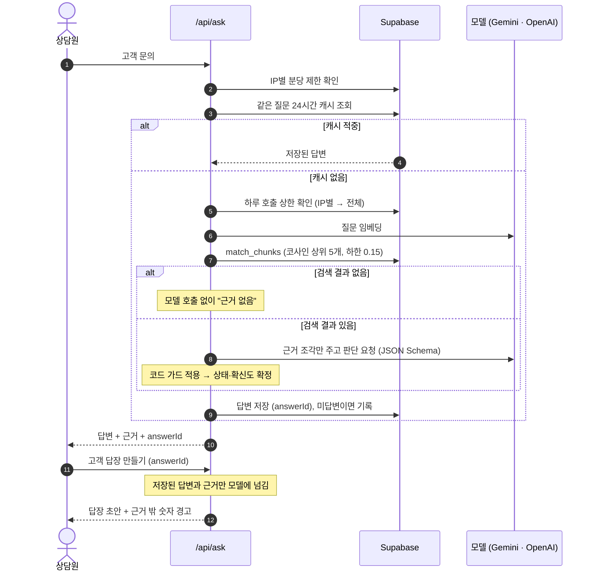
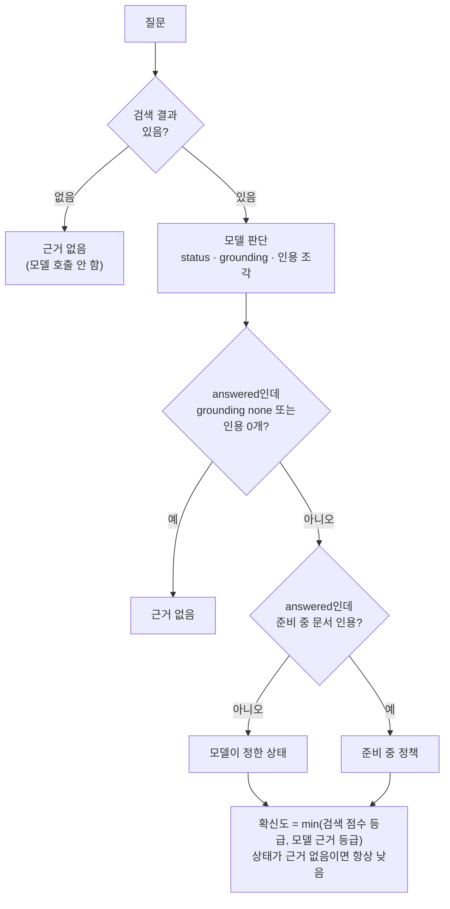
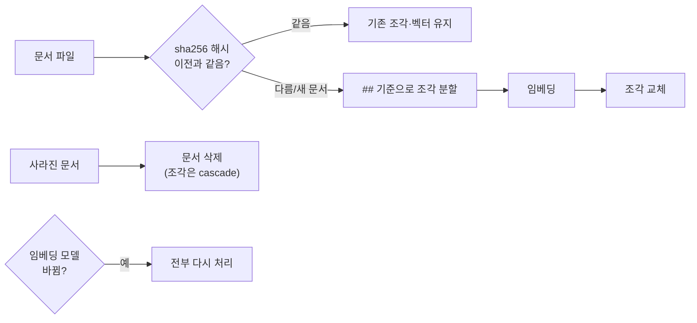
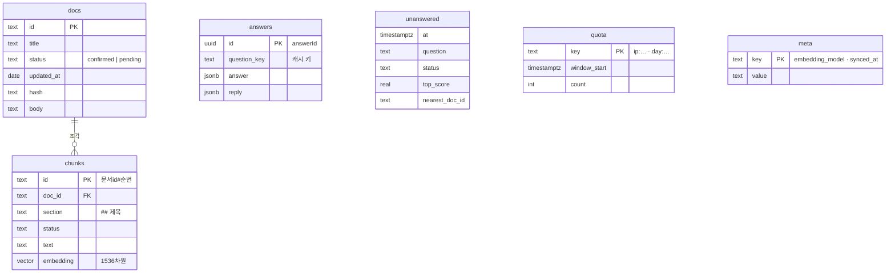

# Architecture

- 가상 OTT 서비스 시네웨이브(CineWave) 고객센터용 정책 답변 코파일럿과 자동 응대 에이전트
- 핵심 원칙: 근거가 있으면 근거와 함께 답하고, 없으면 모른다고 말함
- 가장 중요한 지표: 잘못된 답변률 (답하면 안 되는 질문에 답한 비율), 자동 응대는 잘못된 자동 발송 (넘겨야 하는데 자동으로 보낸 건)

## 한눈에 보기

- 화면은 프레임워크 없는 정적 HTML·JS, API는 표준 Request/Response 핸들러 하나
- 같은 핸들러를 로컬 개발 서버와 Vercel 함수가 공유
- 저장소는 환경 변수로 선택: Supabase가 없으면 로컬 JSON 파일·메모리

## 질문 처리 흐름

## 답변 상태 결정

## 문서 동기화

- 문서 행(메타·원문)은 매번 전부 upsert, 조각은 바뀐 문서만 교체
- 원문도 같은 동기화로 저장 → 정책 문서 탭에서 보는 문서 = 코파일럿이 검색하는 문서

## 데이터 모델

- 모든 테이블 RLS 켜고 정책 없음, DB 함수는 서버 역할만 실행 → 공개 키로는 읽기·쓰기 불가

## 설계 결정

### 1. 거절은 검색 점수가 아니라 모델의 근거 판단으로

- 결정: 검색 하한은 0.15로 느슨하게 두고, 답할지 말지는 모델이 조각 안에 근거가 있는지 판단
- 이유: 1차 평가에서 두 분포가 겹침
  - 답해야 하는 구어체 질문: 정답 문서 유사도 0.3 미만까지 떨어짐
  - 거절해야 하는 질문: 유사도 최대 0.48
  - 어떤 하한을 잡아도 과잉 거절이나 잘못된 답변 중 하나가 생김
- 결과: 과잉 거절률 18.8% → 6.3%, 잘못된 답변률 0% 유지

### 2. 확신도는 두 신호 중 약한 쪽

- 검색 점수 등급(0.5 이상 높음, 0.35 이상 보통)과 모델 근거 판단(full·partial·none) 중 낮은 쪽
- 모델이 "충분"이라고 해도 검색 점수가 낮으면 낮음 → 상담원에게 "원문을 직접 확인" 경고
- 확신도 낮음과 근거 없음은 미답변 기록으로 → 운영 화면에서 문서 보강 후보로

### 3. 모델 판단 위에 코드 가드

- 검색 결과가 없으면 모델을 부르지 않음 → 지어낸 답이 나올 여지 자체를 없앰
- 모델이 answered라고 해도 근거 판단 none이거나 인용 조각이 없으면 근거 없음으로 바꿈
- 준비 중 문서를 근거로 확정 답을 내면 준비 중 정책으로 바꿈
- 모델이 없는 조각 id를 인용하면 무시
- 이유: 규칙으로 검증할 수 있는 불변식은 프롬프트에만 맡기지 않음

### 4. "준비 중" 정책을 별도 상태로

- 문서 frontmatter `status: pending` → 답변 상태 `pending_policy`
- 확정 전 정책을 확정처럼 안내하는 사고를 막기 위함. 화면에서 주황 배지와 "약속하지 말 것" 안내

### 5. 상담원 답변과 고객 답장을 두 단계로

- 1단계 답변: 정확성·근거 확인용. 상담원이 근거를 본 뒤에만 2단계로
- 2단계 답장: 표현·말투용 전용 프롬프트. 입력은 확인된 답변과 인용 근거뿐
- 답장의 숫자 중 답변·근거에 없는 것을 코드로 찾아 경고
- 첫 줄 고정 인사말도 코드가 한 번 더 맞춤
- 답장은 `answerId`로만 요청 → 클라이언트가 보낸 임의 텍스트가 모델에 들어가지 않음
- 버튼을 누를 때만 생성 → 모든 질문에 호출이 두 배가 되지 않음

### 6. 질문 재작성(query rewriting)은 채택하지 않음

- 소형 모델로 구어체 질문을 정책 용어로 바꿔 검색해 봄
- 한 문항(q13)은 고쳤지만 다른 문항(q15)이 새로 실패, 검색 적중률 34 → 33
- 호출 1회와 새 실패 지점을 더하는 대신 운영 루프(미답변 리포트 → 문서 보강)로 어휘 차이를 줄이기로

### 7. 해시 기반 증분 동기화

- 문서 원문의 sha256이 같으면 다시 임베딩하지 않음
- 비용 절감에 더해 결과 안정성: 같은 텍스트도 다시 임베딩하면 벡터가 조금 달라져 순위가 바뀔 수 있음 (3차 평가 기록 참고)
- 임베딩 모델이 바뀌면 벡터 공간이 달라지므로 전부 다시 처리

### 8. 저장소를 인터페이스로 분리

- core는 `Search`, `IndexRepo`, `UnansweredLog`에만 의존
- 로컬(JSON·메모리)과 Supabase가 같은 core를 씀 → 단위 테스트는 가짜 임베더로, 평가는 실제 저장소로
- pgvector 검색은 로컬과 같은 코사인 계산 → 같은 벡터로 42/42 동일 확인 (3차 평가 기록)
- 조각 수십 개 규모라 벡터 인덱스 없이 전수 비교. 수천 개를 넘으면 hnsw 인덱스 추가

### 9. 공개 데모 비용 방어

| 장치 | 값 | 역할 |
|---|---|---|
| IP별 분당 요청 | 20회 | 연타 방지 |
| IP별 하루 모델 호출 | 30회 | 한 방문자가 전체 한도를 다 쓰지 못하게 |
| 전체 하루 모델 호출 | 300회 | 최대 비용 상한 |
| 질문 길이 | 300자 | 긴 입력으로 비용 부풀리기 방지 |
| 같은 질문 캐시 | 24시간 | 반복 질문은 모델 호출 없이 |

- 캐시 적중은 하루 상한에 세지 않음. IP별 상한을 먼저 확인해 막힌 요청이 전체 한도를 깎지 않게
- 분당 제한은 처음 6회 → 질문 하나에 답변·답장 2번이라 예시 몇 개만 눌러도 걸려서 배포 후 조정

### 10. 데모 링크가 깨지지 않게

- API 없음·서버 오류·하루 한도 소진 시 화면이 목업 모드로 전환하고 이유를 표시
  - 목업 데이터는 평가 때 저장한 실제 모델 응답 42건과 실제 답장 초안
- Supabase 무료 프로젝트는 약 7일간 요청이 없으면 일시정지 → Vercel Cron이 하루 한 번 `/api/keepalive` 호출
  - `CRON_SECRET`이 맞을 때만 실행, 지난 호출 제한 기록도 함께 정리

### 11. 빌드는 Vercel Build Output API로 직접

- 소스는 Node 타입 스트리핑용으로 `.ts` 확장자 import를 씀 → Vercel의 TS 자동 빌드에 맡기지 않음
- esbuild로 API를 하나로 번들해 `.vercel/output`을 직접 생성, Cron 설정도 함께

### 12. 콜드 스타트 동시 요청에 런타임은 하나만

- 첫 배포 테스트에서 답장 요청이 방금 만든 답변을 못 찾는 문제
- 원인: 화면이 `/api/docs`와 `/api/ask`를 동시에 보내고, 런타임을 `await` 뒤에 값으로 저장 → 두 요청이 각자 런타임(메모리 저장소 포함)을 만듦
- 해결: 값이 아니라 Promise를 저장. 초기화가 실패하면 다음 요청에서 다시 시도

### 13. 생성 모델은 설정 한 줄로 교체, 같은 평가셋으로 비교

- 후보·공식 단가는 `src/core/models.ts` 한 곳. `GENERATION_MODEL` 환경 변수로 배포 없이 교체
- 제공사마다 다른 설정을 맞춤: 구조화 출력(OpenAI `json_schema` strict / Gemini `responseJsonSchema`), 추론량(effort low / thinkingLevel LOW / 2.5는 thinkingBudget), 비추론 모델은 추론 설정을 보내지 않음(400)
- 임베딩은 고정: 바꾸면 전체 재동기화가 필요하고 검색 결과까지 달라져 생성 모델 차이만 볼 수 없음
- 평가는 모델마다 3회, 결과에 프롬프트 버전 저장. 선택 과정: [docs/model-selection.md](docs/model-selection.md)

### 14. 대체 모델과 호출 시간 예산

- 기본 `gemini-3.8-flash` → 대체 `gpt-5.4-mini`. 대체는 반드시 다른 제공사 (같은 제공사면 장애·키 문제에 같이 멈춤)
- 실패 분류

| 실패 | 예 | 처리 |
|---|---|---|
| 일시 | 429 · 5xx · 타임아웃 · 네트워크 | 대체 모델 + warn 알림 |
| 제공사 설정 | 401 · 403 · 404 (키 폐기 · 권한 · 모델 종료) | 대체 모델 + error 알림 (사람이 조치) |
| 요청 오류 | 400 · 422 | 넘기지 않고 실패 (코드·스키마 버그를 대체 모델이 가리지 않게) |

- 시간 예산: Vercel 함수 30초 = 기본 10초 + 대체 10초 + 임베딩·DB
  - 서비스 호출은 10초·같은 제공사 재시도 없음. 장애 중엔 같은 곳에 다시 보내도 대부분 실패 → 다른 제공사로 넘기는 게 재시도
  - 평가는 30초·4회 시도 (완주 우선, Gemini 무료 티어 분당 제한 대응)
  - 이전 설정은 호출 하나가 최대 90초라 대체 모델까지 갈 수 없었음
- 사용량 기록의 `fallbackFrom`으로 어느 호출이 대체 모델로 처리됐는지 남김

### 15. 사용량·비용 기록과 알림

- `usage` 테이블(0003): 판단·답장 호출마다 모델 · 토큰 · 비용 · 지연 · 대체 여부 · 실패 오류
  - 운영 탭: 오늘 비용 / 하루 예산, 최근 7일 일별 호출 · 비용 · 대체 · 실패 · p95
  - DB 함수 `usage_daily`와 `src/core/usage.ts`의 `summarizeDaily`가 같은 규칙 (UTC 날짜, 미등록 모델 비용 0)
- 알림 (Slack Incoming Webhook, 없으면 콘솔)
  - 대체 모델 전환, 요청 처리 실패(500), 헬스체크 실패, 하루 예산 80% 도달
  - 같은 알림은 30분(예산은 하루)에 한 번: 중복 확인을 호출 제한과 같은 `quota` 테이블로 → 서버리스 인스턴스가 여러 개여도 한 번
  - 알림·기록은 부가 기능: 실패해도 응답은 그대로. 서버리스라 응답 전에 await로 마침
- `GET /api/health`: 저장소 연결과 조각 수 확인 (모델은 안 부름, 호출마다 비용). 내부 오류 메시지는 알림으로만, 공개 응답엔 상태만

### 16. 자동 응대: 판단은 코드, 연결은 n8n

- 고객 문의 → 개인정보 가림 → 판단·답장 초안 → 자동 발송 기준 → 자동 답장 또는 문의함
- 자동 발송 기준은 `src/core/triage.ts` 한 곳: 조치 요청 → 근거 없음 → 준비 중 → 저확신 → 근거 밖 숫자 (먼저 걸린 것이 넘김 사유)
  - "환불해 주세요"는 정책 답이 맞아도 사람이 처리해야 함 → 판단 출력에 `requestType`(question·action)
- 넘길 때 맥락: AI 판단, 가까운 문서(문서별 최고 점수), 질문 벡터가 비슷한 처리 완료 티켓(코사인 0.5 이상, `match_resolved_tickets`), 답장 초안
  - 질문 벡터는 검색 때 만든 것을 그대로 써서 추가 호출 없음. API 응답에는 넣지 않음
- 모델이 실패해도 문의는 "처리 실패"로 접수 → 문의를 잃지 않음
- 판단·맥락 수집은 API 코드(단위 테스트·평가셋 대상), n8n은 넘김 알림과 10분마다 SLA 알림
  - n8n → API는 `x-helpdesk-secret` 헤더로 인증, n8n이 실패하면 API가 Slack으로 직접 보내고 `notify_failed` 기록
- 데이터: `tickets`(문의·상태·사유·답변·초안·맥락·질문 벡터) + `ticket_events`(상태 변화 기록 → 타임라인·처리 시간·SLA 재알림 판단) — `0004_tickets.sql`
- 설계·결과: [docs/auto-response-design.md](docs/auto-response-design.md)

### 17. Vercel 함수는 하나

- `/api/*`를 함수 하나(`api/handler`)로 보내고 라우팅은 번들 안의 `createApi`가 처리
- 처음엔 경로마다 함수 폴더에 같은 번들을 복사 → 자동 응대 경로를 더해 13개가 되자 Hobby 플랜 "배포당 함수 12개" 한도로 배포 실패
- 라우트가 원래 경로를 `__path` 쿼리로 넘기고 진입점(`restoreRoutedPath`)이 되살림 → 로컬 개발 서버와 같은 경로로 동작
- 덤으로 배포 산출물이 줄고, 콜드 스타트가 함수 하나에서만 생김
### 18. MCP 서버: 도구 정의 하나, 연결 방식 둘

- 도구는 `HelpdeskFetch(path, init)`에만 의존 → stdio는 배포 API로 fetch, 원격 `/api/mcp`는 같은 `createApi` 핸들러를 내부 호출
- 도구가 DB·모델을 직접 부르지 않고 API를 거침 → 호출 제한·입력 검사·캐시·사용량 기록·알림을 MCP로 우회할 수 없음. 원격은 호출자 IP를 내부 요청에 넘김
- 원격은 무상태 Streamable HTTP(`WebStandardStreamableHTTPServerTransport`, 요청마다 서버 생성) → Vercel 함수 1개 그대로, 세션 저장소 불필요
- 오류는 `isError` 도구 결과로, 되돌릴 수 없는 `reply_to_ticket`은 `destructiveHint`
- 상세: [docs/mcp.md](docs/mcp.md)

## 평가 기록

- 평가셋: `data/synthetic/eval/questions.jsonl` 42문항 (direct 13, paraphrase 12, cross 7, pending 3, unanswerable 7)
- 모델: 1~3차 생성 `gpt-5.4-mini`(reasoning effort low), 4차부터 `gemini-3.8-flash`(thinking level low). 임베딩 `text-embedding-3-small`
- 실행: `npm run eval`

### 1차 — 초기 임계값 (2026-09-26)

- 설정: minScore 0.3, 확신도 high 0.55 / medium 0.42

| 지표 | 값 |
|---|---|
| 검색 적중률 (top 5) | 85.7% (30/35) |
| 상태 정확도 | 85.7% (36/42) |
| 잘못된 답변률 | 0.0% (0/10) |
| 과잉 거절률 | 18.8% (6/32) |

- 틀린 6문항 중 5개가 구어체(paraphrase)
- 원인: 구어체 질문은 정답 문서도 유사도 0.3 미만 → 하한에 잘려 모델까지 못 감
- 관찰: 유사도로는 "답할 수 있음/없음"을 가를 수 없음
  - 답해야 하는 질문: 0.3 미만 ~ 0.69
  - 거절해야 하는 질문: 최대 0.48
  - 두 분포가 겹침 → 거절은 유사도가 아니라 모델 근거 판단이 맡아야 함

### 2차 — 하한 완화 (2026-09-26)

- 설정: minScore 0.15, 확신도 high 0.5 / medium 0.35
  - 하한은 명백히 무관한 조각만 거르는 용도로 축소
  - 확신도 구간은 1차에서 정답 처리된 질문의 유사도 분포(0.41~0.69)에 맞춤

| 지표 | 값 |
|---|---|
| 검색 적중률 (top 5) | 97.1% (34/35) |
| 상태 정확도 | 95.2% (40/42) |
| 잘못된 답변률 | 0.0% (0/10) |
| 과잉 거절률 | 6.3% (2/32) |

- 남은 실패
  - q13 "돈 돌려받을 수 있어요?": 환불 문서가 검색 13위. 구어 표현과 문서 용어의 어휘 차이
  - q42 "연간 결제 할인?": "연간 결제 상품은 없음"이 요금표 조각 안에 묻혀 해당 조각이 상위 5개에 못 듦

### 실험 — 질문 재작성(query rewriting), 채택 안 함

- 방법: 소형 모델(`gpt-5.4-nano`)로 구어체 질문을 정책 용어 문장으로 바꾼 뒤, 원문·재작성 문장 중 높은 유사도로 검색
- 결과: 검색 적중률 34/35 → 33/35
  - q13은 해결 (환불 문서 2위)
  - q15 "와이프랑 동시에 보는데 끊긴대요"가 "환불·해지 기준" 질문으로 바뀌며 새로 실패
- 판단: 재작성 프롬프트 문구 하나에 결과가 흔들림. 한 문항을 고치려고 호출 1회와 새 실패 지점을 추가하는 건 손해
- 대안 후보: 미답변 리포트에 쌓인 표현을 문서에 반영하는 운영 루프로 어휘 차이 해소

### 3차 — Supabase(pgvector) 이전 검증 (2026-09-26)

- 설정: 2차와 같음. 저장소만 로컬 JSON → Supabase
- 결과: 2차와 같은 지표 (검색 적중률 97.1%, 상태 정확도 95.2%, 잘못된 답변률 0%, 과잉 거절률 6.3%), 같은 두 문항 실패

| 비교 | 상위 5개 순서까지 동일 | 점수 최대 차이 |
|---|---|---|
| 로컬 평가 기록 vs Supabase 평가 기록 | 41/42 | 0.002 |
| 같은 질문 벡터, 로컬 인덱스 vs Supabase | 41/42 | 0.002 |
| 같은 질문 벡터, 같은 조각 벡터, 메모리 검색 vs pgvector | 42/42 | 0.0000005 |

- 결론: 검색 계산은 로컬과 pgvector가 같음. 차이는 조각을 다시 임베딩한 데서 생김
  - 같은 텍스트를 다시 임베딩해도 벡터가 조금 다름 (코사인 평균 0.99998, 최소 0.99913)
  - 이 정도 차이로 유사도가 비슷한 조각끼리 순서가 바뀔 수 있음 (q36)
- 의미
  - 해시 기반 증분 동기화는 비용 절감만이 아니라 결과 안정성에도 도움: 바뀌지 않은 문서는 다시 임베딩하지 않으므로 순위가 흔들리지 않음
  - 평가 수치는 소수점 차이보다 실패 문항과 잘못된 답변률 추세로 판단

### 4차 — 생성 모델 10개 비교와 q41 프롬프트 수정 (2026-09-27)

- 설정: 검색·임계값은 2차와 같음. 생성 모델만 바꿔 각 3회 실행
- 기준 평가에서 발견
  - `gpt-5.4-mini` 재평가가 38/42 · 잘못된 답변 1 → 한 번 실행은 믿을 수 없음, 3회 합산으로 전환
  - q41 "TV 앱 다운로드 언제 생기나요?"를 10개 중 8개 모델이 답함 → 프롬프트 규칙 3차까지 수정
  - 호출 126건이 전부 404인 모델이 잘못된 답변률 0%로 보임 → 호출 실패율 20% 초과 평가는 무효 처리
- 결과 (`gemini-3.8-flash`, 프롬프트 `c89e765b`, 3회 합산)

| 지표 | 값 |
|---|---|
| 검색 적중률 (top 5) | 97.1% (102/105) |
| 상태 정확도 | 95.2% (120/126) |
| 잘못된 답변률 | 0.0% (0/30) |
| 과잉 거절률 | 6.3% (6/96) |
| 질문 1,000건 비용 | $1.09 |
| 응답 p50 / p95 | 1.7s / 2.6s |

- 남은 실패: q13 · q42 (2차와 같은 검색 단계 문제, 모든 모델 공통)
- 모델별 전체 결과와 선택 이유: [docs/model-selection.md](docs/model-selection.md)
