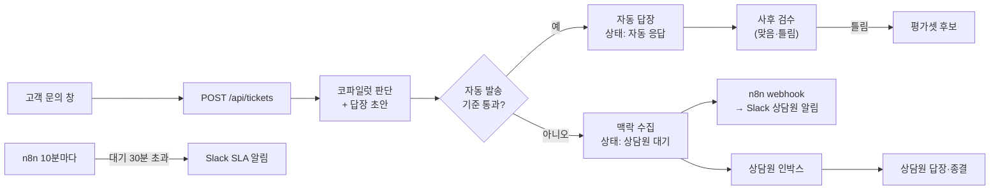

# 자동 응대 설계

- 작성일: 2026-09-27
- 상태: 1차 구현 완료 (웹 문의 창 · 문의함 · n8n 로컬). 결과는 11절
- 한 줄 요약: 고객 문의를 에이전트가 먼저 받아, 확실한 것만 스스로 답하고 나머지는 **상담원이 다시 찾을 필요 없게 맥락을 모아** 넘김

## 1. 왜 바꾸나

- 1~3단계는 상담원이 버튼을 눌러야 동작하는 **코파일럿**
  - 상담원이 없으면 아무 일도 안 일어남. 반복 문의도 상담원이 하나씩 처리
- 목표: 사람이 부르지 않아도 문의를 받아 처리하는 **에이전트**
  - 확실한 정책 질문은 바로 답해 상담원 부담을 줄임
  - 못 하는 건 "못 한다"로 끝내지 않고, 상담원이 바로 이어받을 수 있게 넘김
- 가장 큰 변화: **답이 사람 확인 없이 고객에게 나감**
  - 틀린 답 하나의 비용이 코파일럿 때보다 훨씬 큼 → 자동 발송 기준을 보수적으로 두고 평가셋으로 검증

## 2. 흐름

## 3. 자동 발송 기준

- 아래를 **모두** 만족할 때만 자동 발송. 하나라도 걸리면 상담원에게 넘기고 사유를 남김

| 순서 | 조건 | 걸리면 넘김 사유 |
|---|---|---|
| 1 | 고객이 정책을 묻는 것 (조치 요청이 아님) | `action_request` 개인 처리 요청 |
| 2 | 답변 상태가 확정 답변(answered) | `unanswerable` 근거 없음 · `pending_policy` 준비 중 정책 |
| 3 | 확신도 높음(high) | `low_confidence` 저확신 |
| 4 | 답장에 근거 밖 숫자 없음 | `unsupported_numbers` 근거 밖 숫자 |
| - | 모델 호출 실패 | `error` 처리 실패 |

- **개인 처리 요청을 따로 가르는 이유**
  - "제 결제 취소해 주세요", "이 계정 해지해 주세요"는 정책 질문이 아니라 무언가를 해 달라는 요청
  - 정책 답변이 맞아도 실제 처리(결제 취소, 계정 조치)는 사람이 해야 함
  - 지금 코파일럿은 이 구분이 없음 → 판단 출력에 `requestType`(question · action) 추가
- **준비 중 정책도 1차는 넘김**
  - "확정되면 공지로 안내" 답장은 안전해 보이지만, 준비 중 정책은 고객 불만이 큰 주제(가격·출시일)
  - 운영 데이터를 본 뒤 자동 발송으로 바꿀지 결정
- 기준은 코드(`src/core/triage.ts`) 한 곳. 프롬프트에 맡기지 않음

## 4. 넘길 때 모으는 맥락

- 상담원이 인박스에서 티켓을 열었을 때 **다른 화면을 찾지 않아도 되게**

| 맥락 | 출처 | 상담원이 얻는 것 |
|---|---|---|
| 고객 원문 | 문의 | 무엇을 물었는지 |
| 넘김 사유 | 자동 발송 기준 | 왜 사람이 봐야 하는지 |
| AI 판단·확신도·근거 | 코파일럿 답변 | 어디까지 확인됐는지 |
| 가까운 문서와 점수 | 검색 결과 상위 | 어느 문서부터 볼지 |
| 비슷한 과거 티켓 | 같은 문서 근처의 처리 완료 티켓 | 이전에 어떻게 답했는지 |
| 답장 초안 | 답장 생성 | 고쳐서 바로 보낼 수 있는 시작점 |

- 비슷한 과거 티켓: **질문 벡터 코사인 0.5 이상** 처리 완료 티켓 상위 3건
  - 처음 설계는 "가장 가까운 문서가 같은 티켓"이었음 → 근거 없는 문의는 가까운 문서가 엉뚱해서(해외 시청 → 쿠폰 0.27) 맥락이 가장 필요한 곳에서 실패 (11절)
  - 검색 때 만든 질문 벡터를 그대로 씀 → 추가 호출 없음

## 5. 화면

| 화면 | 경로 | 내용 |
|---|---|---|
| 고객 문의 창 | `#/support` | 문의 입력 → 자동 답장 또는 "상담원에게 전달됨" 표시, 상담원 답장이 오면 갱신 |
| 상담원 인박스 | `#/inbox` | 대기 티켓 목록(사유·대기 시간), 상세(맥락 전부), 답장 수정·발송·종결. 자동 응답 탭에서 사후 검수 |
| 운영 탭 확장 | `#/ops` | 자동 처리율, 넘김 사유별 건수, 처리 시간, SLA 초과, 사후 검수 결과 |

- 공개 데모라 누구나 문의·처리 가능
  - 방문자가 입력한 문의가 다른 방문자에게 보임 → 문의 창에 "개인정보 입력 금지" 안내, 이메일·전화번호 형태는 저장 전에 가림
  - 기존 호출 제한(IP별 분당·하루)을 그대로 적용

## 6. 판단은 코드, 연결은 n8n

- **API(코드)가 맡는 것**: 자동 발송 판단, 맥락 수집, 티켓 상태 변경
  - 단위 테스트와 평가셋으로 검증해야 하는 부분
  - n8n이 꺼져 있어도 데모의 핵심 흐름(문의 → 자동 응답/넘김 → 인박스)은 동작
- **n8n이 맡는 것**: 흐름 연결과 시간 기반 작업
  - 넘김 이벤트 webhook → 상담원 Slack 알림 (티켓 링크·사유·대기)
  - 10분마다 대기 30분 초과 티켓 조회 → SLA 알림
  - 이후 채널 추가(이메일 등)도 n8n에서
- **n8n이 꺼져 있으면**: API가 webhook 실패를 기록하고 기존 Slack 알림으로 직접 보냄 (알림이 사라지지 않게)
- n8n → API 호출은 공유 비밀값 헤더로 인증
- 워크플로우는 `n8n/*.json`으로 저장소에 커밋. 1차는 로컬(`npx n8n`), 동작 확인 후 무료 VM으로

## 7. 데이터

- `tickets`: 문의 한 건
  - 상태: `auto_replied` 자동 응답 · `escalated` 상담원 대기 · `resolved` 처리 완료
  - 넘김 사유, 코파일럿 답변(jsonb), 답장 초안(jsonb), 수집한 맥락(jsonb), 최종 답장, 사후 검수 결과
- `ticket_events`: 상태 변화 기록 (생성·자동 응답·넘김·알림·상담원 답장·종결·검수·SLA 알림)
  - 티켓 상세의 타임라인, 처리 시간 계산
- 기존 규칙 그대로: RLS 켜고 정책 없음, 서버 역할만 접근

## 8. 평가

- 새 평가셋 `data/synthetic/eval/triage.jsonl`: 고객 말투 문의 + 기대 경로(자동·넘김)와 사유
  - 자동으로 답해도 되는 정책 질문, 문서에 없는 질문, 준비 중 정책, **개인 처리 요청**(환불해 주세요 · 해지해 주세요 · 도용 신고 등)
- 지표 (우선순위 순)
  1. **잘못된 자동 발송**: 넘겨야 하는 문의를 자동으로 보낸 건수 → 0이어야 함
  2. 자동 발송한 답의 상태 정확도
  3. 자동 처리율: 자동으로 답해도 되는 문의 중 실제 자동 처리한 비율 (낮으면 상담원 부담이 그대로)
- 판단 프롬프트에 `requestType`이 추가되므로 기존 42문항 평가도 다시 돌려 회귀가 없는지 확인

## 9. 구현 순서

1. 판단 로직과 데이터: `requestType`, 자동 발송 기준, 티켓 저장소, API, 자동 응대 평가
2. 화면: 고객 문의 창, 인박스, 운영 탭
3. n8n: 넘김 알림, SLA 알림
4. 배포 (Supabase 마이그레이션 → Vercel)

## 10. 하지 않는 것 (1차)

- 이메일·Slack 등 다른 채널 → 웹 문의 창으로 흐름을 끝까지 만든 뒤
- 상담원 로그인·배정 → 데모는 누구나 상담원
- 실제 결제 취소·계정 조치 연동 → 개인 처리 요청은 상담원에게 넘기는 것까지

## 11. 1차 구현 결과 (2026-09-27)

### 자동 응대 평가 (22문항 × 3회, 프롬프트에 requestType 추가 후)

| 지표 | gemini-3.8-flash (기본) | gpt-5.4-mini (대체) |
|---|:---:|:---:|
| **잘못된 자동 발송** | **0/33** | **0/33** |
| 자동 처리율 | 24/33 (72.7%) | 24/33 (72.7%) |
| 넘김 사유 일치 | 33/33 | 33/33 |
| 조치 요청 분류 (action 재현율) | 18/18 | 18/18 |
| 정책 질문을 조치로 오분류 안 함 | 48/48 | 48/48 |

- 자동으로 못 보낸 3문항(t02 · t08 · t09)은 모두 **저확신**: 모델 근거 판단은 full, 정답 문서도 1위인데 검색 유사도가 0.39~0.48로 "높음" 기준(0.5) 아래
  - 고객 말투가 짧고 구어체라 유사도가 낮게 나옴. 기준은 상담원 말투 질문으로 정했던 값
  - 1차는 그대로 둠 (잘못된 자동 발송 0이 자동 처리율보다 우선). 기준 조정은 평가셋으로 검증할 실험으로 [백로그](backlog.md)
- 쌍으로 넣은 "해지는 어디서 해요?"(질문) / "해지해 주세요"(요청)를 모두 구분

### 회귀 확인 (기존 42문항 × 3회)

- gemini-3.8-flash: 120/126 · 잘못된 답변 0/30 → requestType 추가 전과 같음
- gpt-5.4-mini: 118/126 · 잘못된 답변 0/30 (전 120) → q27을 2회 거절. 원래 흔들리던 문항(검색 상위에 account-security가 빠지는 경우), 틀린 방향은 거절 쪽

### 로컬에서 끝까지 돌려 보며 고친 것

- **임베딩은 대체 모델이 없음**: OpenAI 임베딩이 몇 분간 응답하지 않자 문의가 "처리 실패"로 넘어감 (접수는 유지)
  - 생성 모델 호출 설정(10초·재시도 없음)을 임베딩에도 쓰고 있었음 → 임베딩 전용 4초·1회 재시도
  - 실패 기록에 모델 이름만 있어서 어느 단계인지 안 보였음 → "임베딩 실패:"로 단계 표시
- **비슷한 과거 티켓을 문서 기준으로 찾으면 근거 없는 문의에서 실패** → 질문 벡터 유사도로 (4절)
  - 실측: 같은 뜻 0.56~0.80, 다른 주제 0.10~0.44 → 기준 0.5
- **n8n 재시작 직후 webhook 404**: 헬스체크는 OK인데 등록은 몇 초 뒤 → API가 Slack 직접 전송으로 대신, notify_failed 기록 ([n8n/README.md](../n8n/README.md))
