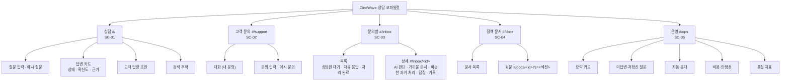
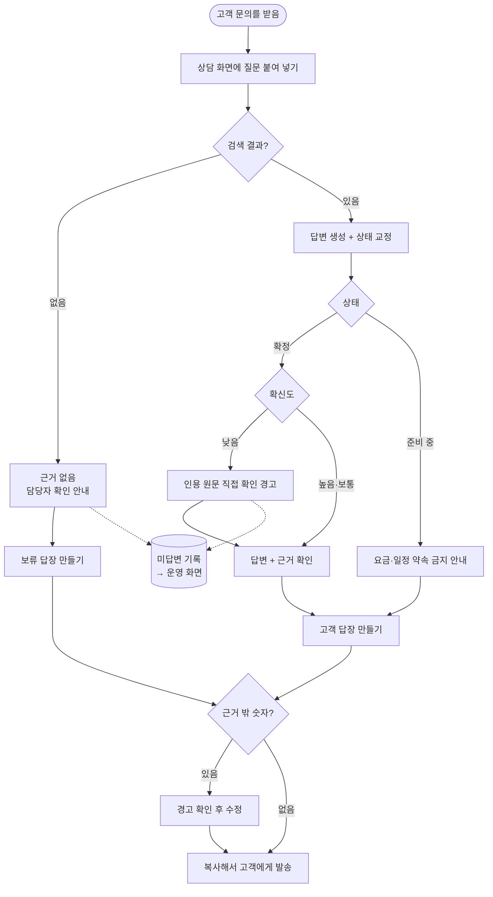
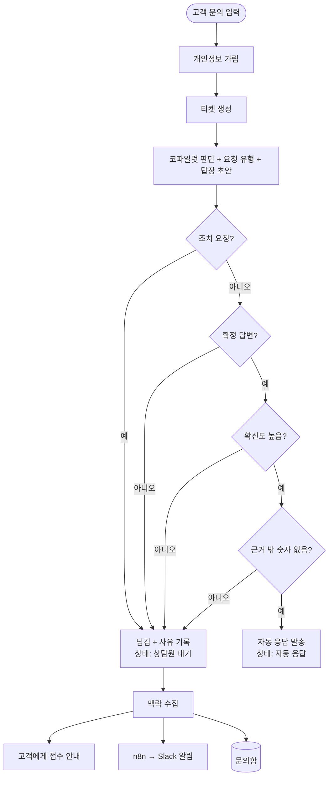
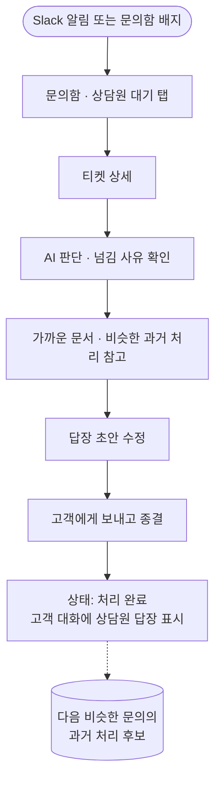
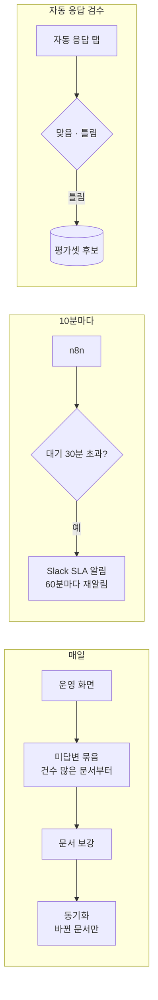
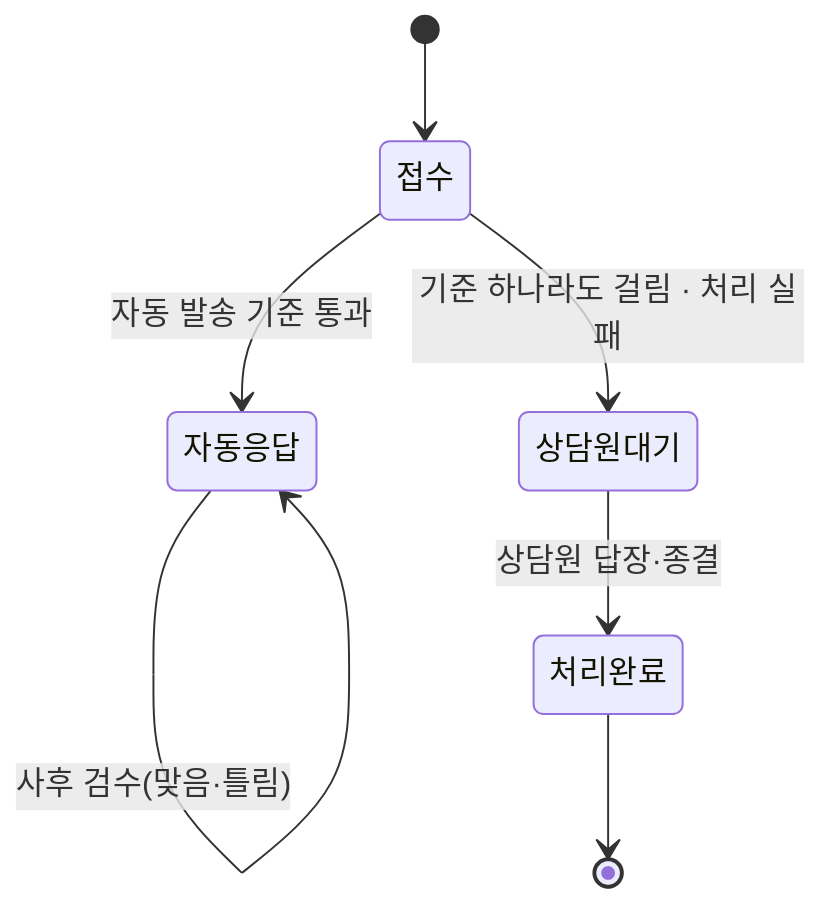

# IA · 서비스 플로우

## 1. IA (정보 구조)

| 메뉴 | 주 사용자 | 목적 |
|---|---|---|
| 상담 | 상담원 | 정책 질문에 근거와 함께 답을 확인하고 고객 답장 작성 |
| 고객 문의 | 고객 (데모에선 방문자) | 문의를 보내고 자동 응답 또는 상담원 답장을 받음 |
| 문의함 | 상담원 | 넘어온 문의를 맥락과 함께 처리 |
| 정책 문서 | 상담원 | 근거 원문 확인 |
| 운영 | CS 운영자 | 문서 보강, 자동 응대·비용·품질 관리 |

- 메뉴 순서는 상담원의 하루 흐름 순: 질문 확인(상담) → 고객 입장 확인(고객 문의) → 처리(문의함) → 원문(정책 문서) → 관리(운영)
- 데모에서는 고객 문의와 상담원 화면을 한 사이트에 둠 → 방문자가 양쪽 입장을 모두 체험

## 2. 서비스 플로우

### F-01 상담원: 정책 질문 → 고객 답장

### F-02 고객: 문의 → 자동 응답 또는 넘김

- 모델 호출 실패 시에도 접수는 유지하고 사유 '처리 실패'로 넘김

### F-03 상담원: 넘어온 문의 처리

### F-04 운영자: 문서 보강과 SLA

## 3. 티켓 상태 전이

| 상태 | 코드 | 고객에게 보이는 것 | 상담원에게 보이는 것 |
|---|---|---|---|
| 자동 응답 | `auto_replied` | AI 자동 응답 | 자동 응답 탭, 사후 검수 |
| 상담원 대기 | `escalated` | "문의가 접수되었습니다" | 대기 탭, 사유·대기 시간 |
| 처리 완료 | `resolved` | 상담원 답장 | 처리 완료 탭 |
