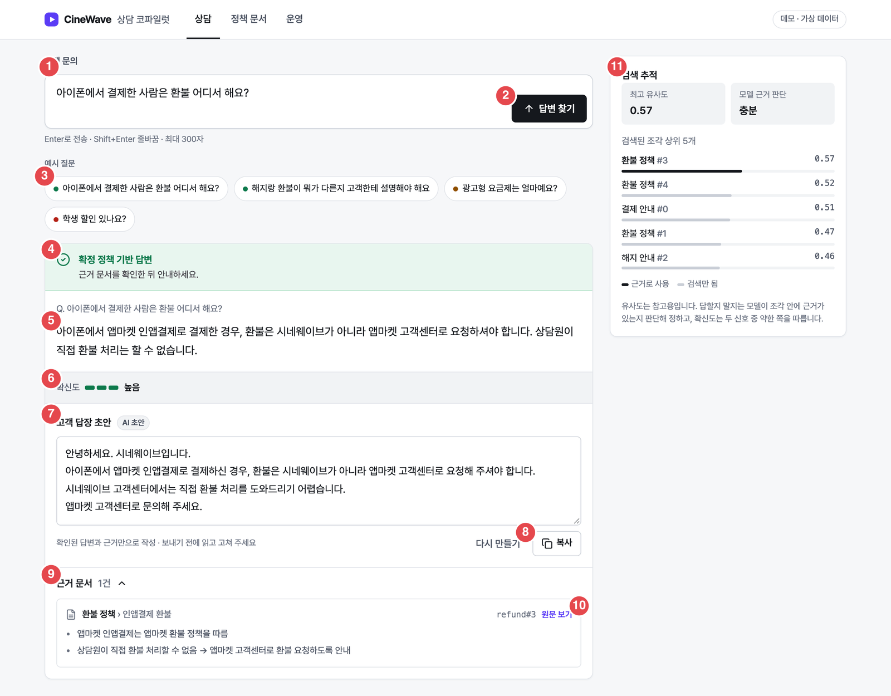
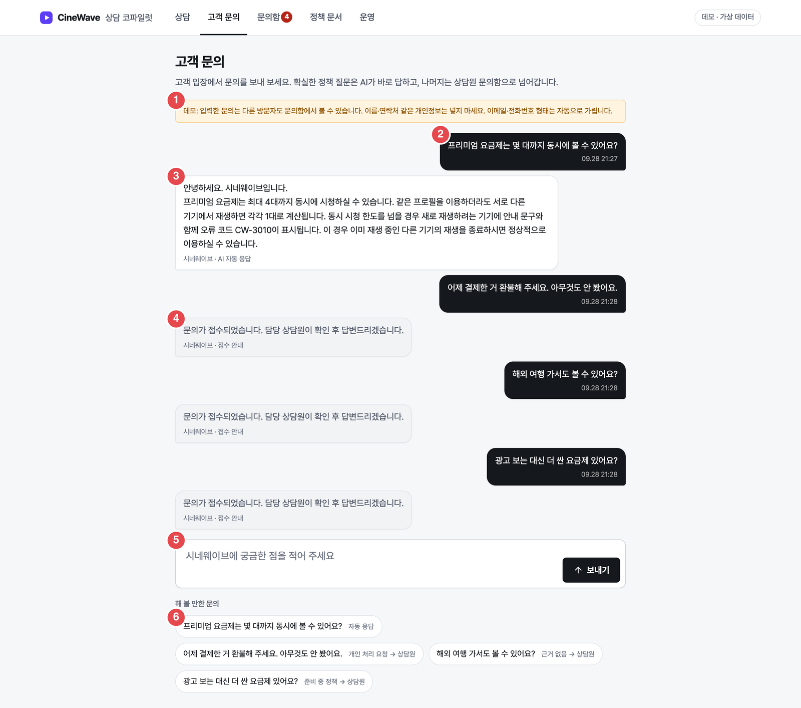
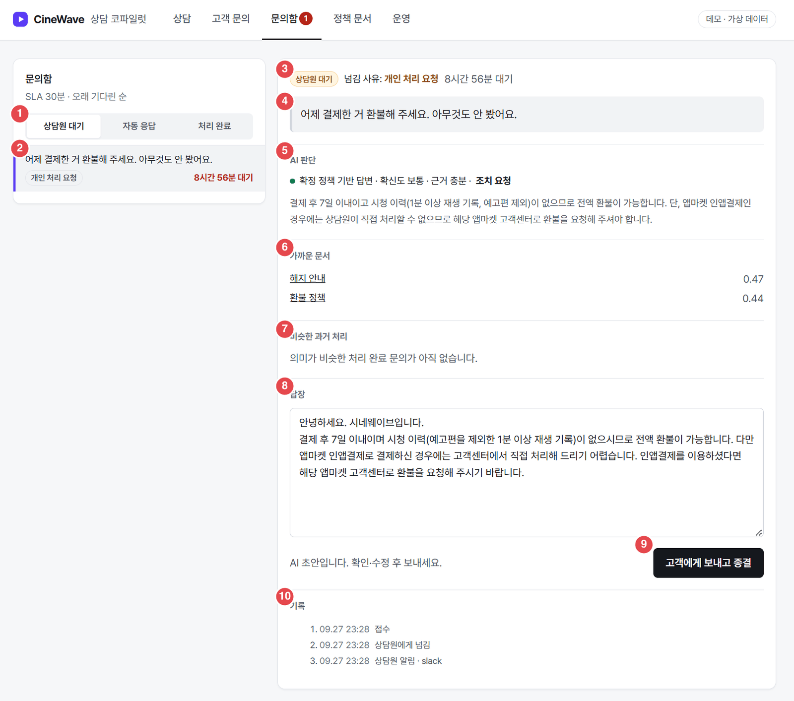
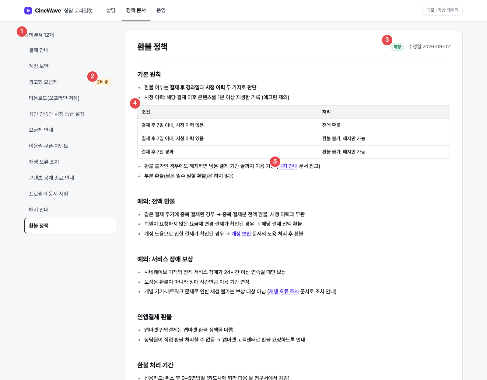
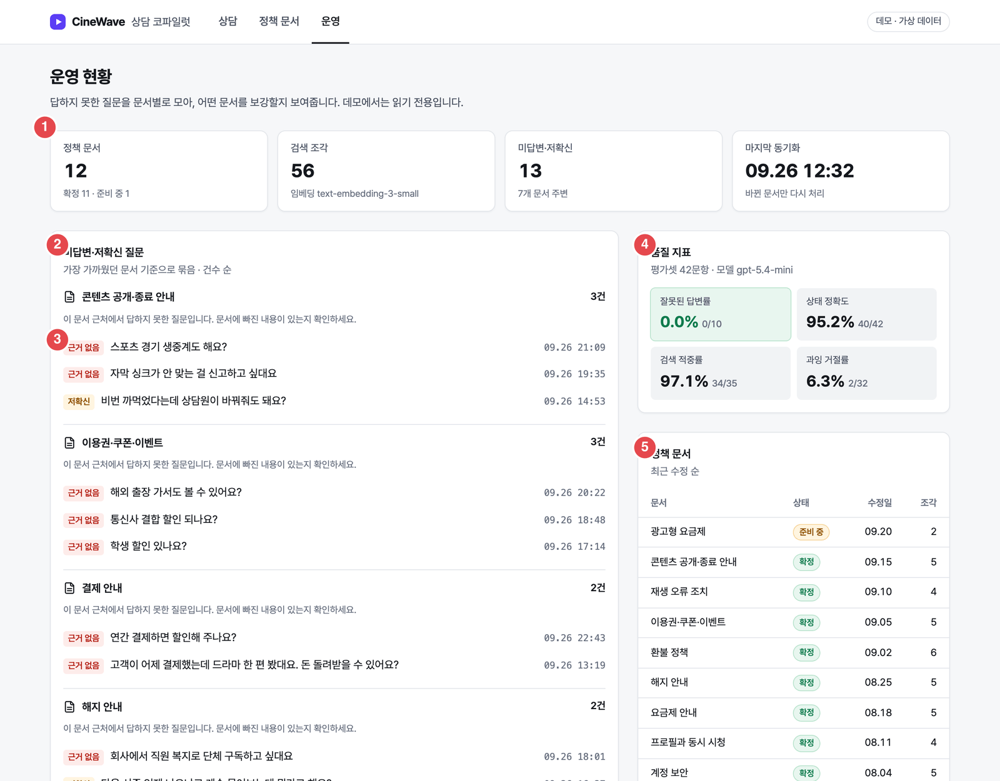

# 화면설계서

- 화면 ID: `SC-01` 상담 · `SC-02` 고객 문의 · `SC-03` 문의함 · `SC-04` 정책 문서 · `SC-05` 운영
- 번호는 캡처 위 빨간 원과 표의 번호가 대응. 기능 ID는 [기능정의서](02-functional-spec.md)
- 캡처는 라이브 데모 기준. SC-01·SC-04·SC-05는 자동 응대 메뉴(고객 문의·문의함)가 추가되기 전에 찍은 것이라 상단 메뉴가 3개로 보임

## 공통

| 요소 | 내용 |
|---|---|
| 상단 메뉴 | 상담 · 고객 문의 · 문의함(대기 건수 배지) · 정책 문서 · 운영 |
| 데모 표시 | 오른쪽 위 "데모 · 가상 데이터" |
| 톤 | 업무 도구. 무채색 바탕, 색은 답변 상태에만 (확정 초록 · 준비 중 주황 · 근거 없음 빨강) |
| 상태 표시 | 색만으로 구분하지 않음: 아이콘 + 라벨 + 상담원이 할 행동 한 줄 |
| 반응형 | 모바일은 단일 열. 라이트 모드 고정 |
| 목업 모드 | 호출 상한 초과·서버 연결 실패 시 저장된 실제 응답으로 동작하고 상단에 이유 표시 |

---

## SC-01 상담

- 경로: `#/` · 사용자: 상담원 · 플로우: [F-01](03-ia-and-flows.md#f-01-상담원-정책-질문--고객-답장)

| 번호 | 영역 | 설명 | 동작·상태 | 기능 ID |
|:---:|---|---|---|---|
| 1 | 고객 문의 입력 | 상담원이 고객 질문을 붙여 넣음 | Enter 전송 · Shift+Enter 줄바꿈 · 최대 300자. 한글 조합 중 Enter 무시 | CP-01 |
| 2 | 답변 찾기 | 질문 전송 | 처리 중 버튼 비활성, 답변 영역에 로딩 표시 | CP-03, 04 |
| 3 | 예시 질문 | 처음 방문자용 | 칩 점 색으로 결과 상태 예고 (초록 확정 · 주황 준비 중 · 빨강 근거 없음). 누르면 바로 질문 | CP-02 |
| 4 | 상태 배너 | 답변 상태와 상담원이 할 행동 | 확정: "근거 문서를 확인한 뒤 안내" / 준비 중: "요금·일정을 약속하지 말 것" / 근거 없음: "추측하지 말고 담당자 확인" | CP-05 |
| 5 | 답변 본문 | 질문 원문과 답변 | 근거 없음이면 답변 대신 보류 안내 | CP-04 |
| 6 | 확신도 | 3칸 막대 + 라벨 (높음·보통·낮음) | 확정 답변에만 표시. 낮음이면 "인용 원문을 직접 확인" 경고 | CP-06 |
| 7 | 고객 답장 초안 | 고객에게 보낼 문장, 편집 가능 | 처음엔 "고객 답장 만들기" 버튼. 근거 없음이면 "보류 답장 만들기". 근거 밖 숫자가 있으면 초안 위에 경고 | RP-01~05 |
| 8 | 다시 만들기 · 복사 | 초안 재생성, 클립보드 복사 | 복사 후 "복사됨" 피드백 | RP-05 |
| 9 | 근거 문서 | 인용 문서 제목 › 섹션, 발췌 | 기본 펼침. 접기 가능 | CP-07 |
| 10 | 원문 보기 | 정책 문서 화면의 해당 섹션으로 이동 | `#/docs/<id>?s=<섹션>` | DC-03 |
| 11 | 검색 추적 | 최고 유사도, 모델 근거 판단, 검색된 조각 상위 5개와 점수 | 근거로 쓴 조각(진한 막대)과 검색만 된 조각(옅은 막대) 구분 | CP-08 |

---

## SC-02 고객 문의

- 경로: `#/support` · 사용자: 고객 (데모에선 방문자) · 플로우: [F-02](03-ia-and-flows.md#f-02-고객-문의--자동-응답-또는-넘김)

| 번호 | 영역 | 설명 | 동작·상태 | 기능 ID |
|:---:|---|---|---|---|
| 1 | 데모 안내 | 입력한 문의가 다른 방문자에게 보일 수 있음, 개인정보 입력 금지 | 항상 표시. 이메일·전화번호 형태는 자동으로 가림을 명시 | SP-01 |
| 2 | 고객 말풍선 | 보낸 문의와 시각 | 이 브라우저에서 보낸 문의만 표시 | SP-07 |
| 3 | AI 자동 응답 | 자동 발송 기준을 통과한 답 | 발신 표시 "시네웨이브 · AI 자동 응답" | SP-04 |
| 4 | 접수 안내 | 상담원에게 넘어간 문의 | "문의가 접수되었습니다. 담당 상담원이 확인 후 답변드리겠습니다." 상담원이 답하면 10초 안에 상담원 답장으로 바뀜 | SP-05, 07 |
| 5 | 문의 입력 | 고객 문의 작성·전송 | 전송 중 "답변을 확인하고 있습니다…" 표시 | SP-01 |
| 6 | 해 볼 만한 문의 | 예시와 예상 경로 | "자동 응답" / "개인 처리 요청 → 상담원" / "근거 없음 → 상담원" / "준비 중 정책 → 상담원" | SP-08 |

---

## SC-03 문의함

- 경로: `#/inbox`, 상세 `#/inbox/<티켓 id>` · 사용자: 상담원 · 플로우: [F-03](03-ia-and-flows.md#f-03-상담원-넘어온-문의-처리)

| 번호 | 영역 | 설명 | 동작·상태 | 기능 ID |
|:---:|---|---|---|---|
| 1 | 탭 | 상담원 대기 · 자동 응답 · 처리 완료 | 기본은 상담원 대기. 상단 "SLA 30분 · 오래 기다린 순" | IB-01 |
| 2 | 목록 항목 | 고객 원문, 넘김 사유, 대기 시간 | 선택 항목은 왼쪽 강조선. SLA 초과 대기 시간은 빨강 | IB-01 |
| 3 | 상태 · 사유 · 대기 | 티켓 상태 배지, 넘김 사유, 대기 시간 | 사유 라벨은 [정책 2](05-policy.md#2-넘김-사유) | IB-02 |
| 4 | 고객 원문 | 개인정보가 가려진 문의 | 가린 부분은 `[이메일]` 등으로 표시 | SP-01 |
| 5 | AI 판단 | 상태 · 확신도 · 근거 판단 · 요청 유형, 판단 내용 | 조치 요청이면 "조치 요청" 강조 | SP-06 |
| 6 | 가까운 문서 | 검색 상위 문서와 점수 | 문서명을 누르면 정책 문서로 이동 | SP-06 |
| 7 | 비슷한 과거 처리 | 질문 의미가 비슷한(0.5 이상) 처리 완료 티켓 상위 3건과 당시 답장 | 없으면 "의미가 비슷한 처리 완료 문의가 아직 없습니다." | SP-06 |
| 8 | 답장 | AI 초안, 편집 가능 | 안내 "AI 초안입니다. 확인·수정 후 보내세요." | IB-03 |
| 9 | 고객에게 보내고 종결 | 발송 + 상태 '처리 완료' | 빈 답장·2000자 초과 불가. 처리 후 목록에서 빠지고 고객 화면에 상담원 답장 표시 | IB-03 |
| 10 | 기록 | 접수 · 넘김 · 알림 · 답장·종결 · 검수 · SLA 알림 타임라인 | 알림 실패도 기록 | IB-02 |

- 자동 응답 탭의 상세에는 답장 대신 사후 검수(맞음·틀림) 버튼 (IB-04)

---

## SC-04 정책 문서

- 경로: `#/docs`, `#/docs/<문서 id>?s=<섹션>` · 사용자: 상담원

| 번호 | 영역 | 설명 | 동작·상태 | 기능 ID |
|:---:|---|---|---|---|
| 1 | 문서 목록 | 정책 문서 12개, 한글 제목 순 | 선택 문서 강조 | DC-01 |
| 2 | 준비 중 배지 | 확정 전 정책 | 준비 중 문서는 본문 상단에 "요금·일정을 약속하지 말 것" | DC-04 |
| 3 | 상태 · 수정일 | 확정/준비 중, 마지막 수정일 | - | DC-01 |
| 4 | 원문 | 마크다운(표·목록·굵게·제목) 렌더링 | 원문을 이스케이프한 뒤 변환 → HTML 주입 없음. 섹션 파라미터가 있으면 해당 섹션으로 스크롤 | DC-02, 03 |
| 5 | 문서 간 링크 | 본문 속 다른 문서 참조 | 해당 문서로 이동 | DC-02 |

---

## SC-05 운영

- 경로: `#/ops` · 사용자: CS 운영자 · 플로우: [F-04](03-ia-and-flows.md#f-04-운영자-문서-보강과-sla)
- 캡처는 1차(자동 응대 전) 화면. 현재는 아래 표의 자동 응대 · 비용·안정성 패널이 추가됨

| 번호 | 영역 | 설명 | 동작·상태 | 기능 ID |
|:---:|---|---|---|---|
| 1 | 요약 카드 | 정책 문서(확정·준비 중), 검색 조각, 미답변·저확신 건수, 마지막 동기화 | 읽기 전용 | OP-01 |
| 2 | 미답변·저확신 질문 | 가장 가까웠던 문서 기준으로 묶음, 건수 순 | 묶음마다 "문서에 빠진 내용이 있는지 확인" 안내 | OP-02 |
| 3 | 질문 상태 라벨 | 근거 없음(빨강) · 저확신(주황) | - | OP-02 |
| 4 | 품질 지표 | 잘못된 답변률 · 상태 정확도 · 검색 적중률 · 과잉 거절률 | 평가셋 기준, 사용 모델 표시. 잘못된 답변률은 강조 카드 | OP-05 |
| 5 | 정책 문서 표 | 문서 · 상태 · 수정일 · 조각 수, 최근 수정 순 | - | OP-01 |
| (추가) | 자동 응대 | 자동 처리율, 넘김 사유별 막대, 처리 시간, SLA 초과, 사후 검수 결과 | - | OP-03 |
| (추가) | 비용·안정성 | 오늘 비용, 모델별 호출 수, 대체 모델 전환, 실패 | 하루 예산 80%에서 Slack 알림 | OP-04 |
