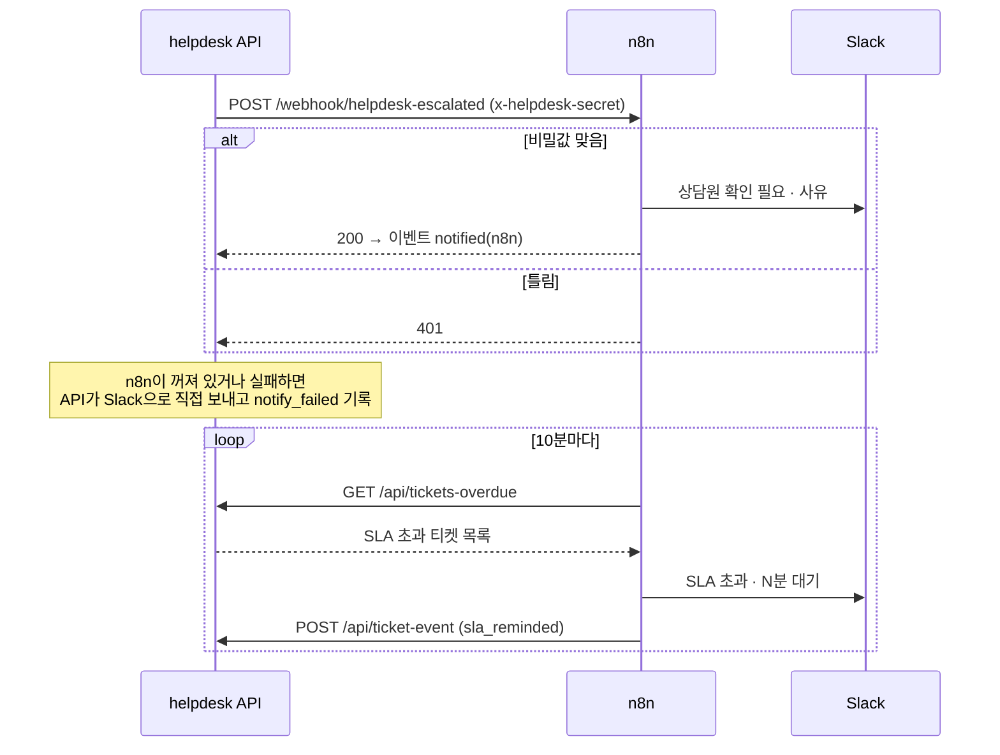

# n8n 워크플로우

- 자동 응대에서 **흐름 연결과 시간 기반 작업**을 맡는 워크플로우 2개
- 판단(자동 발송·넘김·맥락 수집)은 API 코드에 있음. n8n이 꺼져 있어도 문의 접수·자동 응답·문의함은 동작
- 설계: [docs/auto-response-design.md](../docs/auto-response-design.md) 6절

| 파일 | 트리거 | 하는 일 |
|---|---|---|
| `escalation-notify.json` | webhook `POST /webhook/helpdesk-escalated` | 비밀값 확인 → Slack 상담원 채널에 넘김 알림 (사유·문의·가까운 문서·문의함 링크) |
| `sla-reminder.json` | 10분마다 (+ 수동 실행) | `GET /api/tickets-overdue` → 대기 30분 넘은 티켓마다 Slack 알림 → `POST /api/ticket-event`로 기록 (60분 안에는 재알림 안 함) |

## 흐름



## 환경 변수

| 어디 | 변수 | 값 |
|---|---|---|
| n8n | `HELPDESK_N8N_SECRET` | API와 같은 임의의 긴 문자열 |
| n8n | `HELPDESK_API_URL` | 예: `https://helpdesk-copilot.vercel.app` |
| n8n | `SLACK_WEBHOOK_URL` | Slack Incoming Webhook |
| n8n | `N8N_BLOCK_ENV_ACCESS_IN_NODE=false` | 워크플로우에서 `$env` 읽기 허용 |
| API | `N8N_WEBHOOK_URL` | 예: `https://<n8n 주소>/webhook/helpdesk-escalated`. 없으면 Slack으로 직접 |
| API | `HELPDESK_N8N_SECRET` | 위와 같은 값. 없으면 n8n 전용 경로 거부 |

## 로컬 실행 (n8n 2.x)

```bash
npm install n8n --prefix ~/tools/n8n        # 한 번만
export N8N_USER_FOLDER=~/tools/n8n/data N8N_BLOCK_ENV_ACCESS_IN_NODE=false
N8N="node ~/tools/n8n/node_modules/n8n/bin/n8n"

$N8N import:workflow --input=n8n/escalation-notify.json
$N8N import:workflow --input=n8n/sla-reminder.json
$N8N publish:workflow --id=hdEscalateNotify     # 2.x는 activate 대신 publish
$N8N publish:workflow --id=hdSlaReminder001

HELPDESK_N8N_SECRET=... HELPDESK_API_URL=http://localhost:3000 SLACK_WEBHOOK_URL=... $N8N start
# SLA 알림 한 번 바로 돌리기 (실행 중인 n8n과 내부 포트가 겹치지 않게)
N8N_RUNNERS_BROKER_PORT=5680 $N8N execute --id=hdSlaReminder001
```

## 실행하며 알게 된 것

- **import에는 워크플로우 `id`가 필요** (2.x): 없으면 `NOT NULL constraint failed: workflow_entity.id`
- **`/healthz`가 OK여도 webhook 등록은 몇 초 뒤**: 그 사이 요청은 404 → API가 Slack으로 직접 보내 알림이 사라지지 않음
- **일정 트리거는 CLI로 바로 실행할 수 없음**: `Missing node to start execution` → 수동 실행 트리거를 같이 둠
- **`execute`는 실행 중인 n8n과 task broker 포트(5679)가 겹침** → `N8N_RUNNERS_BROKER_PORT`를 다르게
